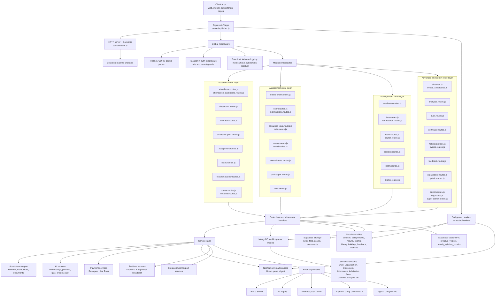

# 🏗️ ClassGrid Ultimate Frontend Architecture Blueprint

> **Purpose:** This document is the persistent source of truth for the ClassGrid Frontend development. It maps the 41 completed backend modules to exact Frontend Routes, React Components, and API Hooks. 
> 
> **AI Rule:** Any AI agent (Codex, Cursor, etc.) reading this document must ONLY build the frontend components listed here and wire them to the listed API prefixes. **DO NOT TOUCH THE BACKEND.**

---

## 🧭 1. Core Architecture Stack

| Layer | Technology |
|---|---|
| **Framework** | React (Vite) or Next.js App Router (depending on `client/` setup) |
| **Styling** | Tailwind CSS + Shadcn UI + Framer Motion |
| **Data Fetching** | React Query / SWR + Axios |
| **State Mgmt** | Zustand (for global UI state, drawer states, theme) |
| **Routing** | Role-based layout wrappers (e.g., `<OrgAdminLayout>`) |
| **Base API URL** | `https://api.classgrid.in/api` or `http://localhost:3000/api` |

---

## 📊 2. The 8 Master Dashboards (Layouts)

Every dashboard has its own dedicated Layout component to prevent UI leakage between roles.

| Dashboard | Route Prefix | Layout Component | Primary API Prefix |
|---|---|---|---|
| 1. Super Admin Panel | `/superadmin` | `SuperAdminLayout.tsx` | `/api/super-admin` |
| 2. Org Admin (Principal) | `/org` | `OrgAdminLayout.tsx` | `/api/org-admin` |
| 3. Student Portal | `/student` | `StudentLayout.tsx` | `/api/student` |
| 4. Faculty Console | `/faculty` | `FacultyLayout.tsx` | `/api/teacher-planner` |
| 5. Admission Dept | `/dept/admissions` | `AdmissionLayout.tsx` | `/api/admission` |
| 6. Fee Dept | `/dept/fees` | `FeesLayout.tsx` | `/api/fees` |
| 7. Library Dashboard | `/dept/library` | `LibraryLayout.tsx` | `/api/library` |
| 8. Canteen Dashboard | `/dept/canteen` | `CanteenLayout.tsx` | `/api/canteen` |

---

## 🧩 3. The 41 Modules: Frontend Component Mapping

*This maps your exact 41 marketing modules to the frontend components we need to build.*

### 📚 Category A: Academic (9 Modules)
| Module | Frontend Route | Key React Components | API Hook |
|---|---|---|---|
| 1. Attendance System | `/org/attendance` | `AttendanceHeatmap`, `DailyDefaultersList` | `useAttendanceStats()` |
| 2. Digital Classroom | `/org/classrooms` | `ClassroomGrid`, `ClassActivityFeed` | `useClassrooms()` |
| 3. Automated Timetable| `/org/timetable` | `MasterTimetableViewer`, `ConflictAlerts` | `useTimetable()` |
| 4. Academic Planning | `/org/curriculum` | `LessonPlanTree`, `SyllabusTracker` | `useAcademicPlan()` |
| 5. Homework & Assign | `/faculty/assignments`| `AssignmentCreator`, `GradingKanbanBoard` | `useAssignments()` |
| 6. Student Notes | `/student/notes` | `NotesMarketplace`, `PDFViewerModal` | `useNotes()` |
| 7. Teacher Planner | `/faculty/planner` | `WeeklyPlannerCalendar`, `ResourceLinks` | `useTeacherPlan()` |
| 8. Subject Management | `/org/subjects` | `SubjectMappingMatrix`, `DepartmentList` | `useSubjects()` |
| 9. Course Management | `/org/courses` | `CourseVideoPlayer`, `PlaylistManager` | `useCourses()` |

### 📝 Category B: Assessment (9 Modules)
| Module | Frontend Route | Key React Components | API Hook |
|---|---|---|---|
| 10. Online Exam | `/student/exam-portal`| `SecureExamBrowser`, `WebcamProctorWindow` | `useOnlineExam()` |
| 11. Exam Management | `/dept/exams/setup` | `SeatingArrangementMap`, `HallTicketGen` | `useExams()` |
| 12. Interactive Quiz | `/student/quizzes` | `GamifiedQuizPlayer`, `Leaderboard` | `useQuizzes()` |
| 13. Grade & Results | `/dept/exams/results`| `SGPA_CalculatorTable`, `ResultPublishBtn` | `useResults()` |
| 14. Internal Assess | `/faculty/internal` | `RubricGradingTable`, `MarkEntryGrid` | `useInternalMarks()`|
| 15. CET/JEE Exams | `/student/mock-cet` | `OpeFormatExamPlayer`, `RankPredictor` | `useCETMock()` |
| 16. Past Papers | `/student/past-papers`| `PastPaperSearch`, `SolutionViewer` | `usePastPapers()` |
| 17. AI Viva | `/student/viva` | `VoiceInteractionUI`, `AudioVisualizer` | `useAIViva()` |
| 18. Test Series | `/dept/exams/series` | `TestSeriesBundler`, `ScheduleCalendar` | `useTestSeries()` |

### 🏢 Category C: Management (6 Modules)
| Module | Frontend Route | Key React Components | API Hook |
|---|---|---|---|
| 19. Admission Mgmt | `/dept/admissions` | `ApplicationFunnelChart`, `DocumentReviewUI`| `useAdmissions()` |
| 20. Fee Collection | `/dept/fees/collect` | `POS_Terminal`, `ReceiptGeneratorPDF` | `useFeeLedger()` |
| 21. Leave & Payroll | `/org/hr/payroll` | `PayslipGenerator`, `LeaveApprovalQueue` | `usePayroll()` |
| 22. Canteen Mgmt | `/dept/canteen` | `LiveOrderQueue`, `InventoryWarnings` | `useCanteen()` |
| 23. Digital Library | `/dept/library` | `BookCatalogGrid`, `FineCalculator` | `useLibrary()` |
| 24. Alumni Network | `/org/alumni` | `AlumniDirectory`, `DonationTracker` | `useAlumni()` |

### 🚀 Category D: Advanced (9 Modules)
| Module | Frontend Route | Key React Components | API Hook |
|---|---|---|---|
| 25. AI Assistant | `Global Floating FAB` | `ChatWindow`, `AI_Context_Chips` | `useAIAssistant()` |
| 26. Advanced Analytics| `/org/analytics` | `PlatformHealthDashboard`, `TrendCharts` | `useAnalytics()` |
| 27. Audit Trails | `/superadmin/audit` | `LogViewerTable`, `SecurityAlerts` | `useAuditLogs()` |
| 28. Digital Certs | `/org/certificates` | `CertificateDesigner`, `BulkIssuer` | `useCertificates()`|
| 29. Holiday Mgmt | `/org/calendar` | `AcademicCalendar`, `HolidayConfig` | `useHolidays()` |
| 30. Digital ID Cards | `/org/id-cards` | `IDCardPreview_JSX`, `PrintReadyPDF` | `useStudentProfile()`|
| 31. Events Mgmt | `/org/events` | `EventPostCreator`, `RegistrationList` | `useEvents()` |
| 32. Feedback System | `/org/feedback` | `AnonymousFeedbackInbox`, `NPS_Gauge` | `useFeedback()` |
| 33. Institution Web | `/org/cms` | `DragAndDropPageBuilder`, `NewsUploader` | `useOrgWebsite()` |

---

## 🔒 4. AI Coding Protocol (The "Do Not Destroy" Rule)

When feeding instructions to Codex or Cursor to build these frontend components, **you must include this exact block in the prompt**:

```text
[CLASSGRID SYSTEM PROTOCOL]
1. YOU ARE RESTRICTED TO THE \`client/\` DIRECTORY ONLY.
2. DO NOT OPEN, READ, OR MODIFY ANY FILE IN \`server/src/\`.
3. The backend is an enterprise ERP that is 100% finished. 
4. If an API request fails, YOU MUST FIX the frontend fetch logic to match the backend expectation. You are strictly forbidden from creating "mock routes" or altering the backend to fit the frontend.
```
# Backend Module Audit

Read-only source audited: `server/src/routes`, `server/src/controllers`, `server/src/models`, and `server/src/services`.

## Backend Architecture Map



| # | Category | Module | Route file(s) | Model(s) used | Backend completion % | What is missing |
|---:|---|---|---|---|---:|---|
| 1 | Academic | Attendance System | `attendance.routes.js`, `attendance_dashboard.routes.js` | `AttendanceSession.js`, `AttendanceRecord.js`, `AttendanceAppeal.js`, `ClassroomMembership.js`, `Classroom.js`, `User.js`, `Notification.js`, `AdminAuditLog.js` | 90 | Export endpoint is stubbed. |
| 2 | Academic | Digital Classroom Management | `classroom.routes.js` | `Classroom.js`, `ClassroomMembership.js`, `ActivityLog.js`, `Notification.js`, `Organization.js`, `User.js` | 90 | No major backend gap found. |
| 3 | Academic | Automated Timetable | `timetable.routes.js` | `ClassroomMembership.js`, `User.js` | 70 | Manual CRUD exists; no auto-generator/optimizer. `Timetable.js` exists but route uses Supabase instead. |
| 4 | Academic | Academic Planning Tools | `academic-plan.routes.js` | `Classroom.js`, `ClassroomMembership.js` | 80 | Plan/unit/topic CRUD exists; no dedicated model file or progress engine. |
| 5 | Academic | Homework & Assignment | `assignment.routes.js` | `Classroom.js`, `ClassroomMembership.js`, `Notification.js`, `User.js` | 85 | Uses Supabase assignments; `Assignment.js` and `AssignmentSubmission.js` are not used here. |
| 6 | Academic | Student Notes Sharing | `notes.routes.js` | `NoteView.js`, `Quiz.js` | 85 | Upload/view/AI quiz exists; moderation/marketplace flow is split elsewhere. |
| 7 | Academic | Teacher Planner | `teacher-planner.routes.js` | `TeacherPlan.js`, `Classroom.js` | 80 | Planner CRUD exists; missing deeper recurrence/template workflow. |
| 8 | Academic | Subject Management | `course.routes.js`, `marks.routes.js` | `OrgSubject.js`, `Classroom.js`, `ClassroomMembership.js`, `ExamRecord.js`, `StudentMark.js`, `ResultAuditLog.js`, `Organization.js`, `User.js` | 75 | Subject APIs are split between courses and marks; no single subject module. |
| 9 | Academic | Course Management | `course.routes.js`, `hierarchy.routes.js` | `Classroom.js`, `User.js`, `AcademicHierarchy.js`, `Organization.js` | 88 | Strong CRUD/faculty assignment; mostly Supabase-backed, no Course model file. |
| 10 | Assessment | Online Exam Platform | `online-exam.routes.js` | `Classroom.js`, `User.js` | 90 | Full exam/attempt/proctoring flow; duplicate `verify-access` route exists. |
| 11 | Assessment | Examination Management | `exam.routes.js`, `examinations.routes.js` | None in `models/` | 78 | Two overlapping exam route systems; dashboard has approximations/fallback stats. |
| 12 | Assessment | Interactive Quiz Systems | `advanced_quiz.routes.js`, `quiz.routes.js` | `Classroom.js`, `ClassroomMembership.js`, `Notification.js`, `User.js`, `QuizSession.js` | 88 | Advanced quiz is solid; storage is mostly Supabase, not a dedicated quiz model. |
| 13 | Assessment | Grade Entry & Results | `marks.routes.js`, `result.routes.js` | `ExamRecord.js`, `StudentMark.js`, `ResultAuditLog.js`, `OrgSubject.js`, `Classroom.js`, `ClassroomMembership.js`, `Organization.js`, `User.js` | 85 | Marks/results are split across Mongo and Supabase result tables. |
| 14 | Assessment | Internal Assessment Tools | `internal-tests.routes.js` | `User.js` | 75 | Test/marks CRUD exists; no dedicated model file or advanced analytics. |
| 15 | Assessment | CET/JEE/NEET Exam Conduction | `online-exam.routes.js` | `Classroom.js`, `User.js`, `QuizSession.js` | 72 | Generic competitive exam support exists; no dedicated CET/JEE/NEET taxonomy/conduction module. |
| 16 | Assessment | Past Paper & Mock Tests | `past-paper.routes.js` | `PastPaper.js` via `past-paper-analysis.service.js` | 70 | Ingest/analyze/mock/list exists; route lacks auth/role guards. |
| 17 | Assessment | AI-Powered Viva | `viva.routes.js` | `VivaRecord.js`, `ClassroomMembership.js`, `User.js` | 85 | Initialize/evaluate/schedule/dashboard exists; still external-AI dependent. |
| 18 | Assessment | Test Series Management | `online-exam.routes.js` | `Classroom.js`, `User.js` | 70 | Implemented as `exam_mode = test_series`; no separate series/package model. |
| 19 | Management | Admission Management | `admission.routes.js` | `AdmissionApplication.js`, `AdmissionConfig.js`, `AdmissionOTP.js`, `CETAllotment.js`, `SeatConfig.js`, `AcademicHierarchy.js`, `FeeStructure.js`, `StudentFeeLedger.js`, `FeeTransaction.js`, `FeeRecord.js`, `Organization.js`, `User.js` | 95 | Very complete; mainly needs continued test hardening. |
| 20 | Management | Fee Collection System | `fees.routes.js`, `fee-records.routes.js` | `FeeRecord.js`, `Notification.js`, `Organization.js`, `User.js` | 80 | Fee logic is split; `fee.controller.js` ledger models are not mounted by routes. |
| 21 | Management | Staff Leave & Payroll | `leave.routes.js`, `payroll.routes.js` | `Classroom.js`, `ClassroomMembership.js`, `User.js`, `FacultyPayroll.js`, `FacultyBiometricLog.js` | 72 | Payroll exists; leave is mostly student/class leave, not full staff leave. |
| 22 | Management | Canteen Management | `canteen.routes.js` | `CanteenItem.js`, `CanteenOrder.js`, `Organization.js` | 90 | Menu/order/payment/queue/analytics exist; vendor/procurement not found. |
| 23 | Management | Digital Library Management | `library.routes.js` | `Notification.js`, `User.js` | 82 | Catalog/issue/return/reserve/analytics exist; no Library model file, fine payment not evident. |
| 24 | Management | Alumni Network | `alumni.routes.js` | `User.js` | 55 | Only alumni listing/status/docs/self-view; no directory, events, jobs, messaging network. |
| 25 | Advanced | AI Assistant | `ai.routes.js`, `thread_chat.routes.js` | `AttendanceRecord.js`, `QuizSession.js`, `StudentMark.js`, `User.js` | 65 | RAG/persona/chat helpers exist; route role uses `super-admin`, likely inconsistent with `super_admin`. |
| 26 | Advanced | Advanced Analytics | `analytics.routes.js`, `admin.routes.js` | `Assignment.js`, `AssignmentSubmission.js`, `AttendanceRecord.js`, `AttendanceSession.js`, `Classroom.js`, `User.js`, `VivaRecord.js` | 75 | Analytics are useful but distributed; no single advanced analytics service surface. |
| 27 | Advanced | Compliance Audit Trails | `audit.routes.js`, `admin.routes.js`, `super-admin.routes.js` | `AdminAuditLog.js`, `User.js`, `StudentMark.js`, `AttendanceSession.js`, `AttendanceRecord.js`, `FeeRecord.js`, `Timetable.js`, `Classroom.js`, `FeedbackResponse.js`, `NotePackage.js` | 75 | Compliance reports exist; immutable module-wide audit trail is partial. |
| 28 | Advanced | Digital Certificates | `certificate.routes.js` | `Classroom.js`, `ClassroomMembership.js` | 75 | Certificate CRUD/approval/analytics exists; no Certificate model, PDF/QR issuance not found. |
| 29 | Advanced | Holiday Management | `holidays.routes.js` | None in `models/` | 85 | Manual/sync/upcoming/today exists; recurrence/import depth unclear. |
| 30 | Advanced | Digital ID Cards | `org.routes.js` | `Organization.js` | 25 | Only ID card display config found; no ID card route/model/generation endpoint. |
| 31 | Advanced | Events Management | `events.routes.js` | None in `models/` | 80 | Event CRUD/list exists; no RSVP/ticketing/attendance workflow found. |
| 32 | Advanced | Feedback System | `feedback.routes.js` | `Classroom.js`, `User.js` | 88 | Forms/submissions/analytics/AI insights exist; Supabase-backed, feedback model files unused here. |
| 33 | Advanced | Institution Website | `org-website.routes.js`, `public.routes.js` | `OrgWebsiteContent.js`, `Organization.js`, `DemoRequest.js` | 85 | CMS/publish/public resolve exists; theme/media depth limited. |
| 34 | Dashboards | Admission Management Dashboard | `admission.routes.js` | `AdmissionApplication.js`, `AdmissionConfig.js`, `CETAllotment.js`, `SeatConfig.js`, `Organization.js`, `User.js` | 92 | `/analytics` and `/cet/dashboard` exist; tied to admission roles. |
| 35 | Dashboards | Fee Management Dashboard | `fees.routes.js`, `fee-records.routes.js` | `FeeRecord.js`, `Organization.js`, `User.js` | 80 | Analytics/summary exist; split fee systems reduce completeness. |
| 36 | Dashboards | Library Management Dashboard | `library.routes.js` | `Notification.js`, `User.js` | 80 | `/analytics` exists; no dedicated library model/fine payment dashboard. |
| 37 | Dashboards | Student Management Dashboard | `student.routes.js`, `student-profile.routes.js`, `org.routes.js`, `analytics.routes.js` | `User.js`, `DeviceVerification.js`, `AdmissionApplication.js`, `Organization.js`, `Classroom.js` | 65 | Student data pieces exist; no single dedicated student management dashboard route. |
| 38 | Dashboards | Faculty Management Dashboard | `org.routes.js`, `user.routes.js`, `payroll.routes.js`, `teacher-planner.routes.js` | `User.js`, `Organization.js`, `Classroom.js`, `FacultyPayroll.js`, `TeacherPlan.js` | 62 | Faculty pieces exist; no dedicated faculty dashboard aggregation route. |
| 39 | Dashboards | Organization Management Dashboard | `org.routes.js`, `admin.routes.js`, `super-admin.routes.js` | `Organization.js`, `User.js`, `Classroom.js`, `AdminAuditLog.js`, `OrganizationUsage.js`, `OrgSubscription.js`, `SystemLog.js` | 82 | Broad coverage; `/api/org-admin/dashboard` is still described as placeholder and helpdesk routes are duplicated. |
| 40 | Dashboards | Canteen Management Dashboard | `canteen.routes.js` | `CanteenItem.js`, `CanteenOrder.js`, `Organization.js` | 90 | `/analytics` and live queue exist; no major backend gap found. |
| 41 | Dashboards | Leave Management Dashboard | `leave.routes.js`, `analytics.routes.js` | `Classroom.js`, `ClassroomMembership.js`, `User.js`, `AttendanceRecord.js`, `AttendanceSession.js` | 78 | Summary/calendar/leave stats exist; staff leave is not fully covered. |
