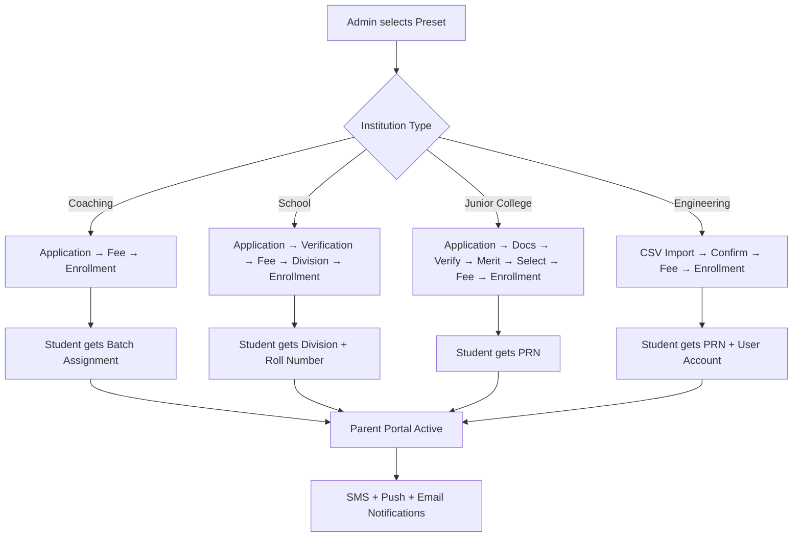

# Classgrid Admission Management System — Implementation Plan

> **Module 21: The Admission Engine**
> A production-grade, config-driven, multi-tenant admission workflow system supporting Coaching Classes, Schools, Junior Colleges, and Engineering Colleges.

--

## Background & Context

Classgrid currently handles **post-onboarding** student lifecycle (classrooms, attendance, quizzes, fees, etc.) but has **no structured admission pipeline**. Students currently join via Honor Code or Classroom Code — which works for existing students, but provides zero control over the intake funnel (applications, verification, merit selection, seat allocation).

This module transforms Classgrid from an "academic management tool" into a **complete institutional ERP** — the same way EduPlus Campus handles admissions for colleges across Maharashtra.

### Existing Architecture (What We Build On)

| Layer | Technology | How Admission Uses It |
|-------|-----------|----------------------|
| Auth | JWT + Cookie | New `admission_token` system (separate from main auth) |
| Users | MongoDB `User` model | Applicants convert to `User` after enrollment |
| Org | MongoDB `Organization` model | Extended with `admission_config` |
| Fee System | Supabase `fee_structures` / `student_fees` | Admission fees reuse existing fee engine |
| Email | Brevo + `email-templates.service.js` | Token delivery, status notifications |
| Code Gen | `code-generator.service.js` | Token generation reuses existing CSPRNG |
| Divisions | Supabase `divisions` table | Post-admission allocation target |

---

## User Review Required

> [!IMPORTANT]
> **Decision 1: Token Expiry Duration**
> How long should admission tokens stay valid? Recommended: **72 hours** (3 days) for standard portals, **7 days** for engineering CAP round imports. Confirm or override.

> [!IMPORTANT]
> **Decision 2: Admission Fee vs Academic Fee**
> Should admission fees be tracked separately in a new `admission_fees` table, or reuse the existing `fee_structures` / `student_fees` Supabase tables with an `is_admission_fee` flag? Recommendation: **Reuse existing fee system** with a flag — avoids duplicating 600+ lines of fee routes.

> [!WARNING]
> **Decision 3: Google Workspace Email Generation**
> Full Google Workspace Admin SDK integration (auto-creating `firstname.lastname@college.edu.in` emails) requires the college to grant Classgrid domain-wide delegation. This is a complex setup. Recommendation: **Phase 1 = Email suggestion generator only** (shows what the email *would* be). Phase 2 = optional API integration later.

> [!IMPORTANT]
> **Decision 4: Public Admission Portal URL**
> Should the admission portal be accessible at:
> - **Option A:** `org-slug.classgrid.in/admissions` (subdomain, requires Nginx wildcard SSL)
> - **Option B:** `app.classgrid.in/admissions/org-slug` (path-based, simpler)
>
> Recommendation: **Option B** for MVP (no SSL changes needed), migrate to Option A later.

---

## Proposed Changes

### Phase 1: Database Schema & Models

---

#### [NEW] AdmissionConfig (embedded in Organization model)

Extend `Organization.js` with an `admission_config` subdocument:

```javascript
admission_config: {
  // Portal Control
  portal_active: { type: Boolean, default: false },
  portal_open_date: { type: Date, default: null },
  portal_close_date: { type: Date, default: null },
  
  // Authentication & Security (Track-Specific OTP Flow)
  auth_config: {
    // 🚩 ENTRY POINT LOGIC
    // Engineering: Starts w/ Email OTP (EN lookup)
    // School/Coaching: Starts w/ Phone OTP (Guardian/Student)
    primary_entry_method: { type: String, enum: ["email", "phone"], default: "phone" },
    
    mandatory_verifications: {
      email: { type: Boolean, default: true },  // Must verify 1 personal email
      phone: { type: Boolean, default: true }   // Must verify 1 personal phone
    },

    require_phone_otp_verification: { type: Boolean, default: true }, // Fast2SMS
    allow_social_login: { type: Boolean, default: false }
  },
  
  // Institution Preset
  admission_preset: {
    type: String,
    enum: ["coaching", "school", "junior_college", "engineering", "custom"],
    default: "coaching"
  },
  
  // Workflow Stages (ordered array = the flow)
  workflow_stages: [{
    type: String,
    enum: [
      "application", "document_upload", "verification", "merit_calculation", 
      "selection", "fee_payment", "division_assignment", "enrollment",
      
      // Engineering (DTE) Specific Stages
      "import", "reporting", "rla_confirmation"
    ]
  }],
  
  // Stage-Specific Configs
  application_config: {
    collect_documents: { type: Boolean, default: false },
    required_documents: [
      "birth_certificate",           // Essential for preschool-Class 1 age proof
      "student_aadhar",              // Primary ID
      "father_aadhar",               // Parent ID
      "mother_aadhar",               // Parent ID
      "proof_of_residence",          // Passport, Voter ID, Electricity bill, Rent agreement
      "transfer_certificate",        // Mandatory for Transfers
      "previous_academic_records",   // Report cards/Progress reports
      "passport_size_photo",         // Recent student photo
      "form_data": {
        "personal_details": {
          "place_of_birth": "String",
          "gender": "Male/Female/Other",
          "mother_tongue": "String"
        },
        "demographics": {
          "religion": "String (e.g. Hindu)",
          "category": "String (e.g. General, OBC)",
          "caste": "String",
          "sub_caste": "String"
        },
        "parent_details": {
          "father_name": "String",
          "father_aadhaar": "String",
          "father_occupation": "String",
          "father_education": "String",
          "mother_name": "String",
          "mother_aadhaar": "String",
          "mother_occupation": "String",
          "mother_education": "String",
          "annual_income": "Number",
          "emergency_contact": "String"
        },
        "residence": {
          "address": "String",
          "state": "String (Driven by JSON lookup)",
          "district": "String (Driven by JSON lookup)",
          "taluka": "String (Driven by JSON lookup)",
          "village_city": "String",
          "pincode": "String",
          "landmark": "String",
          "proof_type": "String"
        },
        "medical": {
          "blood_group": "String",
          "vaccination_status": "String",
          "known_allergies": "String",
          "chronic_conditions": "String",
          "special_needs": "String",
          "regular_medications": "String"
        },
        "transport": {
          "needs_bus": "Boolean",
          "pickup_point": "String",
          "authorized_pickup_person": "String"
        },
        "previous_education": {
          "school_name": "String",
          "board": "String",
          "class_last_attended": "String",
          "last_exam_percentage": "Number",
          "reason_for_leaving": "String"
        },
        "additional": {
          "sibling_studying": "Boolean",
          "sibling_details": "String",
          "alumni_parent": "Boolean",
          "languages_known": "Array<String>",
          "co_curricular_interests": "String"
        }
      },
      "medical_vaccination_records", // BCG, Polio, Physical fitness
      "caste_certificate",           // SC/ST/OBC/EWS quotas
      "income_certificate"           // EWS/Scholarship proof
    ],
    collect_previous_marks: { type: Boolean, default: false },
    collect_entrance_score: { type: Boolean, default: false },
    custom_fields: [{
      field_name: String,
      field_type: { type: String, enum: ["text", "number", "email", "phone", "date", "select", "file"] },
      options: [String], // for select type
      required: { type: Boolean, default: false },
      requires_otp: { type: Boolean, default: false } // 👈 Only for primary student/guardian contacts
    }],

    // 👨‍👩‍👦 Multi-Contact Collection (Mandatory for Schools/Junior Colleges)
    contact_collection: {
      primary_is_verifed_on_entry: { type: Boolean, default: true },
      secondary_fields: [
        { label: "Father's Phone", type: "phone", otp_required: true },  
        { label: "Father's Aadhaar", type: "text", required: true },
        { label: "Mother's Phone", type: "phone", otp_required: false }, 
        { label: "Mother's Aadhaar", type: "text", required: true },
        { label: "Guardian Email", type: "email", otp_required: false }  
      ]
    }
  },
    document_validity_days: {
      caste_cert: { type: Number, default: 365 },
      income_cert: { type: Number, default: 365 },
      aadhar: { type: Number, default: null } // null = never expires
    }
  },
  
  // SMS Notification Budget Tracker (DeepSeek Gap #6 Fix & Engineering Gap 5: Cost Fix)
  // WARNING: DO NOT use Firebase for bulk SMS. Use Fast2SMS (₹0.09) or MSG91.
  sms_budget: {
    allocated: { type: Number, default: 5000 },
    used: { type: Number, default: 0 },
    alert_threshold: { type: Number, default: 80 } // alerts admin at 80%
  },
  
  verification_config: {
    enabled: { type: Boolean, default: false },
    auto_verify: { type: Boolean, default: false }, // skip manual review
  },
  
  merit_config: {
    enabled: { type: Boolean, default: false },
    criteria: [{
      field: String, // "10th_percentage", "12th_percentage", "entrance_score"
      weight: { type: Number, default: 100 } // percentage weight
    }]
  },
  
  selection_config: {
    enabled: { type: Boolean, default: false },
    auto_select: { type: Boolean, default: false }, // auto-select top N by merit
    seat_capacity: { type: Number, default: 0 }, // 0 = unlimited
  },
  
  fee_config: {
    admission_fee_structure_id: { type: String, default: null }, // default fee
    fee_required_before_enrollment: { type: Boolean, default: true },
    
    // Cancellation & Refund Workflow
    refund_policy: {
      enabled: { type: Boolean, default: false },
      rules: [{ 
        days_before_start: Number, 
        refund_percentage: Number 
      }]
    },
    
    // Scholarships & Management Quota Pricing (TFWS, RTE, Minority)
    scholarship_tracking: { type: Boolean, default: true },
    
    // MHT CET Dynamic Fee Mapping (Decided by Institute)
    default_engineering_fee: { type: Number, default: 0 },
    dynamic_fee_mapping: [{
      cet_attribute: { type: String },  // e.g., "TFWS", "SC", "OBC"
      attribute_type: { type: String, enum: ["category", "seat_type"] },
      fee_structure_id: { type: String } // Maps to the exact Rs amount the college set
    }]
  },
  
  enrollment_config: {
    // Application Edit Window
    editable_until: { type: Date, default: null }, // Student can edit form until this doc-verified date
    auto_enroll_after_fee: { type: Boolean, default: false },
    generate_prn: { type: Boolean, default: false },
    generate_roll_number: { type: Boolean, default: false },
    auto_assign_division: { type: Boolean, default: false },
    auto_create_user_account: { type: Boolean, default: true },
    
    // 🔑 CREDENTIALS UI FLOW
    // Case A (College): Reveal Generated Email + Password Set
    // Case B (School/Coaching): Password Set for Registered Identity
    send_credentials_to_registered_bridge: { type: Boolean, default: true }
  },
  
  // Division Allocation Rules (for schools)
  division_allocation: {
    method: { type: String, enum: ["alphabetical", "merit", "random", "manual"], default: "manual" },
    divisions: [{
      name: String,         // "A", "B", "C"
      capacity: Number,     // max students per division (e.g., 70)
      target_class: String, // "5", "6", "FY-COMPS" etc.
      
      // 🔴 LAB/PRACTICAL BATCH SPLITTING (For Engineering/Colleges)
      // Different from 'Coaching Batches'. These are sub-units of a Division.
      practical_batches: [{
        name: String,       // "A1", "A2", "A3"
        batch_size: Number, // e.g., 23
        roll_range: {
          start: Number,    // e.g., 1
          end: Number       // e.g., 23
        }
      }]
    }]
  },
  
  // PRN Generation Template (Advanced Edge Cases)
  prn_template: {
    enabled: { type: Boolean, default: false },
    format: { type: String, default: "{YEAR:4}{BRANCH_CODE}{SERIAL:3}{REJOIN_FLAG}" },
    // Supported tokens: {YEAR:4}, {YEAR:2}, {BRANCH_CODE}, {COLLEGE_CODE}, {DIVISION}, {SERIAL:N}, {REJOIN_FLAG}
    
    branch_code_mapping: { type: Map, of: String }, 
    // e.g., { 'Computer Engineering': 'COM', 'Mechanical Engineering': 'MEC' }

    rejoin_flag: {
      enabled: { type: Boolean, default: true },
      first_attempt: { type: String, default: '' },      // Empty string for first-time
      rejoin: { type: String, default: 'R' },            // 'R' suffix for rejoining students
      readmission: { type: String, default: 'RA' }       // 'RA' for readmission after dropout
    },
    
    permanent: { type: Boolean, default: true },  // Once assigned, never change
    college_code: { type: String, default: "" },
    next_serial: { type: Number, default: 1 },
  },
  
  // Roll Number Generation
  roll_number_config: {
    enabled: { type: Boolean, default: false },
    scope: { type: String, enum: ["per_division", "global"], default: "per_division" },
    prefix: { type: String, default: "" },
  },
  
  // 📧 Official Email Generation (College Track ONLY)
  email_generation: {
    enabled: { type: Boolean, default: false }, // TRUE for Engineering, FALSE for Schools/Coaching
    domain: { type: String, default: "" }, 
    format: { type: String, default: "{first}.{last}{YY}" },
    
    // UI Flow (The Handshake)
    // 1. System Generates -> 2. System Reveals to Student -> 3. Student Sets Password
    reveal_on_screen: { type: Boolean, default: true },
    warning_message: { type: String, default: "This will be your official college identity. Do not share your password." },
    
    // ✨ IDENTITY CELEBRATION (Frontend UX Sequence)
    ux_stages: [
      { step: 1, label: "Calculating official identity...", animation: "shimmer" },
      { step: 2, label: "Connecting to Cloud Provider...", animation: "pulse" },
      { step: 3, label: "Atomic ID Reservation...", animation: "check-pop" },
      { step: 4, label: "Ready! Congratulations! 🎊", animation: "confetti-reveal" }
    ]
  },

  // 🛠️ THE EMAIL PROVISIONING ENGINE (IDENTITY SERVICE)
  // This logic handles the actual creation on Google/Zoho/Hostinger
  provisioning_config: {
    provider: { type: String, enum: ["google", "microsoft", "zoho", "cpanel", "manual"], default: "manual" },
    api_credentials: {
      client_id: String,
      client_secret: String,
      api_token: String,
      service_account_key: Object // For Google
    },
    conflict_resolution: { type: String, default: "suffix_increment" }, // e.g. amit.s -> amit.s.1
    
    // 🛡️ TIER-1 PROTECTION (Expert-Grade)
    queueing: {
      use_bullmq: { type: Boolean, default: true }, // Zero-wait worker
      retry_limit: { type: Number, default: 3 },    // Failed Google attempts
      atomic_reservation: { type: Boolean, default: true } // Prevent duplicates
    }
  },
  
  // Coaching-Specific
  coaching_config: {
    batch_selection: { type: Boolean, default: false },
    available_batches: [{ name: String, capacity: Number, start_date: Date }],
    course_selection: { type: Boolean, default: false },
    available_courses: [{ name: String, fee: Number }],
    flexible_start_dates: { type: Boolean, default: false },
  },
  
  // Engineering-Specific
  engineering_config: {
    import_mode: { type: String, enum: ["csv", "api", "manual"], default: "csv" },
    cap_round_support: { type: Boolean, default: false },
    confirmation_required: { type: Boolean, default: true },
  }
}
```

---

#### [NEW] `server/src/models/AdmissionApplication.js`

The core applicant record — lives in MongoDB for rich querying:

```javascript
// Core Fields: org_id, applicant_name, email, phone, token (hashed),
// token_expires_at, current_stage, stage_history[], form_data{},
// documents[], merit_score, selected, fee_paid, enrolled,
//
// 🔐 SECURITY & CREDENTIALS
// account_password: { type: String }, // User creates their own pw during form filling
//
// assigned_division, assigned_prn, assigned_roll_number,
// created_user_id (after enrollment), status, remarks

// 🚨 ENGINEERING SPECIFIC SEAT & IDENTITY METADATA:
// imported_en_no: String (e.g., "EN2514770")
// cet_category: String (e.g., "OBC", "SC", "ST", "OPEN" - IMMUTABLE from import)
// seat_type: String (e.g., "GOPENS", "TFWS", "GSCS" - IMMUTABLE from import)
// quota_type: String (e.g., "merit", "management_quota", "nri") // Management Quota
// round_history: [{ round_number: Number, allotted_college: String, status: String }] // Tracks CAP 1, CAP 2 Upgrades
// scholarship_data: { type: String, certificate_number: String, verified: Boolean } 
// Calculated Fee: Generated by dynamic fee engine, not user input.
```

Key design decisions:
- **Token is stored hashed** (SHA-256) — same pattern as `resetPasswordToken`
- **CET Data is Read-Only** — Students cannot modify their `cet_category` or `seat_type` if imported from CAP rounds.
- **`current_stage`** tracks where in the workflow the applicant is.
- **`stage_history`** is an append-only audit log of transitions.
- **`form_data`** is a flexible `Mixed` schema for custom fields (Aadhar, Income certs).

---

#### [NEW] Supabase Tables (via migration SQL)

```sql
-- admission_applications (for RLS-protected queries)
CREATE TABLE admission_applications (
  id UUID PRIMARY KEY DEFAULT gen_random_uuid(),
  org_id TEXT NOT NULL,
  mongo_id TEXT, -- links back to MongoDB document
  applicant_name TEXT NOT NULL,
  email TEXT,
  phone TEXT,
  current_stage TEXT NOT NULL DEFAULT 'application',
  merit_score NUMERIC DEFAULT 0,
  status TEXT NOT NULL DEFAULT 'pending', -- pending, approved, rejected, enrolled, withdrawn
  applied_for TEXT, -- branch/course/class
  created_at TIMESTAMPTZ DEFAULT NOW(),
  updated_at TIMESTAMPTZ DEFAULT NOW()
);

-- Indexes
CREATE INDEX idx_adm_app_org ON admission_applications(org_id);
CREATE INDEX idx_adm_app_status ON admission_applications(org_id, status);

-- RLS
ALTER TABLE admission_applications ENABLE ROW LEVEL SECURITY;
CREATE POLICY "org_isolation" ON admission_applications
  FOR ALL USING (org_id = current_setting('app.org_id', true));
```

---

### Phase 2: Workflow State Machine Engine

---

#### [NEW] `server/src/services/admission-workflow.service.js`

The heart of the system — a **config-driven state machine** that determines transitions:

```
Coaching Default:    application → fee_payment → enrollment
School Default:      application → verification → fee_payment → division_assignment → enrollment
Junior College:      application → document_upload → verification → merit_calculation → selection → fee_payment → enrollment
Engineering:         [import] → confirmation → fee_payment → enrollment
```

**Core logic:**
```javascript
export class AdmissionWorkflow {
  constructor(admissionConfig) {
    this.stages = admissionConfig.workflow_stages;
  }
  
  getNextStage(currentStage) {
    const idx = this.stages.indexOf(currentStage);
    if (idx === -1 || idx >= this.stages.length - 1) return null;
    return this.stages[idx + 1];
  }
  
  canTransition(currentStage, targetStage) {
    const currentIdx = this.stages.indexOf(currentStage);
    const targetIdx = this.stages.indexOf(targetStage);
    return targetIdx === currentIdx + 1;
  }
  
  isComplete(currentStage) {
    return this.stages.indexOf(currentStage) === this.stages.length - 1;
  }
}
```

**Preset Loader:**
```javascript
export const ADMISSION_PRESETS = {
  coaching: {
    workflow_stages: ["application", "fee_payment", "enrollment"],
    application_config: { 
      collect_documents: false,
      form_fields: ["student_name", "date_of_birth", "gender", "parent_name", "parent_phone", "address", "current_class", "target_exam", "10th_percentage", "12th_percentage"]
    },
    verification_config: { enabled: false },
    fee_config: { fee_required_before_enrollment: true },
    enrollment_config: { auto_enroll_after_fee: true, generate_prn: false },
  },
  school: {
    workflow_stages: ["application", "verification", "fee_payment", "division_assignment", "enrollment"],
    application_config: { 
      collect_documents: true, 
      required_documents: ["birth_certificate", "previous_marksheet"],
      form_fields: ["student_name", "date_of_birth", "gender", "parent_name", "parent_phone", "address", "previous_school", "rte_eligibility"]
    },
    verification_config: { enabled: true },
    enrollment_config: { generate_roll_number: true, auto_assign_division: true },
  },
  junior_college: {
    workflow_stages: ["application", "document_upload", "verification", "merit_calculation", "selection", "fee_payment", "enrollment"],
    application_config: { 
      collect_documents: true, 
      form_fields: ["student_name", "date_of_birth", "gender", "parent_name", "parent_phone", "address", "10th_percentage", "caste_category"]
    },
    merit_config: { enabled: true, criteria: [{ field: "10th_percentage", weight: 100 }] },
    enrollment_config: { generate_prn: true },
  },
  engineering: {
    workflow_stages: ["application", "fee_payment", "enrollment"],
    application_config: {
      collect_documents: true,
      form_fields: ["student_name", "date_of_birth", "gender", "aadhar", "parent_name", "parent_phone", "address", "10th_percentage", "12th_pcm_marks", "entrance_score", "caste_category", "caste_certificate", "domicile", "parent_income", "cap_round", "allotment_type"]
    },
    engineering_config: { import_mode: "csv", confirmation_required: true },
    enrollment_config: { generate_prn: true, auto_create_user_account: true },
  }
};
```

---

### Phase 3: Applicant Authentication — Firebase Phone OTP (EXISTING SDK)

---

> [!TIP]
> **We already have a fully working Firebase Phone Auth SDK in the codebase!** No need to build from scratch. The admission portal will reuse this existing infrastructure.

#### [EXISTING] `client/src/services/firebaseAuth.js` — The OTP Engine

This file is **already production-ready** and powers the `PhoneAuthTest.jsx` page. It provides 3 functions:

```javascript
// Firebase Project: classgrid-80056
// Already configured with invisible reCAPTCHA

import { initializeApp, getApps, getApp } from "firebase/app";
import { getAuth, RecaptchaVerifier, signInWithPhoneNumber } from "firebase/auth";

// ✅ setupRecaptcha(buttonElementId)  → Binds invisible reCAPTCHA to a button
// ✅ sendPhoneOTP(phoneNumber)        → Sends OTP via Firebase to +91XXXXXXXXXX
// ✅ verifyPhoneCode(code)            → Verifies the 6-digit code, returns Firebase user
```

#### [EXISTING] `client/src/pages/shared/PhoneAuthTest.jsx` — Working Demo

This test page (already labelled "Classgrid Admissions Firebase Demo") demonstrates:
1. Phone input with `+91` prefix
2. Invisible reCAPTCHA binding on mount
3. OTP send → 6-digit verification → Success toast
4. Error handling with reCAPTCHA reset on failure

**Admission Integration Plan:**
- The `AdmissionPortal.jsx` Step 1 will import `setupRecaptcha`, `sendPhoneOTP`, `verifyPhoneCode` directly from `firebaseAuth.js`
- After phone verification succeeds, the applicant's `phone_verified: true` flag is set on their `AdmissionApplication` document
- No separate admission token system needed for phone-based auth — Firebase handles everything

#### [EXISTING] `server/src/services/firebase.service.js` — Server-Side Push Notifications

The Firebase Admin SDK is already initialized for FCM push notifications:

```javascript
// ✅ sendPushToDevice(fcmToken, title, body, data)    → Single device push
// ✅ sendPushToMultiple(fcmTokens, title, body, data)  → Multicast (batch) push
// Uses FIREBASE_SERVICE_ACCOUNT_JSON env var
// Android channel: "classgrid_notifications"
```

**Admission will use this for:**
- Push notification when application status changes (Verified → Selected → Enrolled)
- Push notification to parents when their child's admission is confirmed
- Bulk push to all selected applicants when fee payment window opens

#### [NEW] `server/src/services/admission-token.service.js` — Email Token Fallback

For applicants who prefer email-based access (no phone):

```javascript
// 1. generateAdmissionToken(email, orgId) → creates 8-char token, sends via Brevo email
// 2. verifyAdmissionToken(token, orgId) → returns application if valid
// 3. Token stored as SHA-256 hash in AdmissionApplication.token
// 4. Reuses existing code-generator.service.js for CSPRNG randomness
// 5. Tokens expire after configurable hours (default 72h)
```

Token format: `ADM-XXXX-XXXX` (8 alphanumeric chars, easy to type on mobile)

**Dual Auth Strategy:**
| Method | When Used | Technology |
|--------|-----------|-----------|
| **Firebase Phone OTP** | Primary (Indian parents prefer SMS) | `firebaseAuth.js` — already built ✅ |
| **Email Token** | Fallback (international applicants, no phone) | `admission-token.service.js` — new |

---

### Phase 4: PRN & Roll Number Generation

---

#### [NEW] `server/src/services/prn-generator.service.js`

Config-driven PRN generation engine:

```javascript
/**
 * Template: "{YEAR}{BRANCH}{SERIAL:4}"
 * Input:    year=2026, branch="COMPS", serial=28
 * Output:   "26COMPS0028"
 *
 * Template: "{COLLEGE_CODE}{DIVISION}{SERIAL:3}"
 * Input:    code="125", division="B1", serial=28
 * Output:   "125B1028"
 */
export function generatePRN(template, data) {
  return template
    .replace("{YEAR}", String(data.year).slice(-2))
    .replace("{BRANCH}", data.branch || "")
    .replace("{COLLEGE_CODE}", data.college_code || "")
    .replace("{DIVISION}", data.division || "")
    .replace(/\{SERIAL:(\d+)\}/, (_, len) => 
      String(data.serial).padStart(parseInt(len), "0")
    );
}
```

#### [NEW] `server/src/services/division-allocator.service.js`

Queue-based division allocation algorithm:

```javascript
/**
 * Allocation Methods:
 * 
 * 1. ALPHABETICAL: Sort students by surname → Fill divisions sequentially
 *    Students: [Agarwal, Bhat, Chavan, Desai, Eknath, Fadnis]
 *    Div A (cap 2): [Agarwal, Bhat]
 *    Div B (cap 2): [Chavan, Desai]  
 *    Div C (cap 2): [Eknath, Fadnis]
 *
 * 2. MERIT: Sort by merit_score DESC → Fill top students in Div A, rest in B/C
 *
 * 3. RANDOM: Fisher-Yates shuffle → Sequential fill
 *
 * 4. MANUAL: Admin drag-and-drop (no auto-allocation)
 */
export function allocateDivisions(students, divisions, method) { ... }
```

---

### Phase 5: Backend API Routes

---

#### [NEW] `server/src/routes/admission.routes.js`

The main API surface (~500 lines estimated):

| Method | Path | Access | Description |
|--------|------|--------|-------------|
| **Admin Portal Control** | | | |
| `GET` | `/config` | org_admin | Get admission config |
| `PUT` | `/config` | org_admin | Update admission config |
| `POST` | `/config/preset` | org_admin | Apply a preset (coaching/school/etc) |
| `PATCH` | `/portal/toggle` | org_admin | Open/close admission portal |
| **Token Management** | | | |
| `POST` | `/tokens/generate` | org_admin | Generate tokens for applicants |
| `POST` | `/tokens/bulk-generate` | org_admin | Bulk generate + email tokens |
| `POST` | `/tokens/verify` | public | Verify token → get application |
| **Application Flow** | | | |
| `POST` | `/apply` | public/token | Submit new application. *Includes Duplicate Detection Check (Gap #3).* |
| `GET` | `/applications` | org_admin | List all applications (paginated, filterable) |
| `GET` | `/applications/:id` | org_admin/token | Get single application |
| `PATCH` | `/applications/:id/stage` | org_admin | Advance/reject application stage |
| `POST` | `/applications/:id/withdraw` | org_admin | Process parent withdrawal + partial fee refund logic (Gap #2) |
| `POST` | `/desk-enroll` | org_admin | Instant Walk-In Admission (Bypass portal, log cash/cheque) (Gap #1) |
| **Bulk Operations & Government Compliance** | | | |
| `POST` | `/import/csv` | org_admin | CSV import (engineering) |
| `POST` | `/bulk-verify` | org_admin | Bulk verify selected applications |
| `POST` | `/bulk-select` | org_admin | Bulk select by merit |
| `GET`  | `/export/dte` | org_admin | Export formatted DTE/AICTE CSV for Maharashtra Gov |
| `POST` | `/applications/merge` | org_admin | Merge duplicate applications into one master record |
| `POST` | `/scholarship/bulk-import` | org_admin | Upload CSV to bulk-assign TFWS/EBC certs & fee waivers |
| **Post-Admission** | | | |
| `POST` | `/generate-prns` | org_admin | Batch PRN generation |
| `POST` | `/allocate-divisions` | org_admin | Run division allocation algorithm |
| `POST` | `/generate-roll-numbers` | org_admin | Batch roll number generation |
| `POST` | `/enroll` | org_admin | Convert applications → User accounts |
| **Parent Portal** | | | |
| `POST` | `/parent/login` | public | Parent login via phone OTP |
| `GET` | `/parent/status/:applicationId` | parent | Get child's admission status |
| `GET` | `/parent/documents/:applicationId` | parent | Download admission letter/receipt |
| **Waitlist** | | | |
| `GET` | `/waitlist` | org_admin | View waitlisted applicants |
| `POST` | `/waitlist/promote` | org_admin | Promote waitlisted → selected |
| **Analytics** | | | |
| `GET` | `/analytics` | org_admin | Application stats, conversion funnel |

---

### Phase 6: Frontend Pages

---

#### [NEW] `client/src/pages/admin/OrgAdminAdmissions.jsx`

The admin dashboard for managing admissions (~800 lines):
- **Tab 1: Overview** — Funnel chart (Applied → Verified → Selected → Enrolled), key metrics
- **Tab 2: Applications** — Sortable/filterable table with stage badges, bulk actions
- **Tab 3: Configuration** — Preset selector + advanced config editor (50+ toggles)
- **Tab 4: Tokens** — Generate/revoke admission tokens, delivery status
- **Tab 5: Allocation** — Division allocation UI, PRN generator, roll number generator
- **Tab 6: Walk-In / Desk Admission** — "Express Registration" for PC lab/receptionist to bypass the public portal. Allows admin to instantly input cash/cheque details, skip document wait-times, and directly jump a physical walk-in student to the "Enrolled" state.
- **Tab 7: Verification Camp** — Tablet-optimized interface. Scan parent's QR code on physical printout to instantly mark "Original Documents Verified" on the floor.
- **Tab 8: Import & Gov Export** — Import CET CSVs, and Generate DTE / AICTE Government compliance reports.
- **Tab 9: Waitlist** — Waitlisted applicants with auto-promote controls

#### [NEW] `client/src/pages/shared/AdmissionWizard.jsx`

The Single Continuous Admission Portal for Schools & Coaching (~600 lines):
- **Purpose:** A seamless, uninterrupted flow for parents going to `orgname.classgrid.in`. 
- **Step 1: Phone Verification** — Lead capture via Firebase OTP.
- **Step 2: Basic Details** — Student name, class/course selection. Can edit until `editable_until` date.
- **Step 3: Heavy Data** — Parent details, address, previous education, scholarship claims (TFWS/EBC).
- **Step 4: Document Upload** — S3/Supabase (Birth cert, Aadhar). Warnings shown if document validity is expired.
- **Step 5: Fee Payment** — Immediate Razorpay checkout.
- **Step 6: Print & Sign (CRITICAL)** — System generates a PDF of the completed form. The parent must print it, sign it physically, and submit it to the Admin office for counter-signature.

#### [MODIFIED] Login Flow (`StudentLogin.jsx` / `OrgLogin.jsx`)

When `org.classgrid.in` loads, if admissions are open, display a **premium Animated Overlay Card**:
- Full-screen glassmorphism popup.
- **"START ADMISSION"** routes to `AdmissionWizard.jsx` (Starts at Step 1).
- **"RESUME ADMISSION"** routes to `AdmissionWizard.jsx` (Uses OTP to jump back to where they left off).
- **"I'm already a student"** dismisses overlay to show standard login.


---

### Phase 7: Parent/Guardian Tracking Portal

---

> [!NOTE]
> **Why this matters:** In India, parents are the decision-makers for admissions (especially schools and junior colleges). A parent portal eliminates the #1 complaint: *"What is the status of my child's admission?"*

#### [NEW] `client/src/pages/shared/ParentAdmissionTracker.jsx`

A read-only mobile-first portal for parents (~300 lines):

```
Parent Flow:
1. Enter child's registered phone number
2. Receive OTP via Firebase Phone Auth (reuses existing firebaseAuth.js)
3. See child's admission status in a beautiful visual pipeline:
   ✅ Applied → ✅ Documents Verified → ⏳ Merit List → ⬜ Fee Payment → ⬜ Enrolled
4. Download admission letter / fee receipt as PDF
5. Receive push notifications on status changes (via existing FCM service)
```

**Key Features:**
| Feature | Description |
|---------|-------------|
| **Visual Pipeline** | Horizontal stepper showing exactly where the child is in the process |
| **Document Checklist** | Green ✅ / Red ❌ indicators for each required document |
| **Fee Payment Link** | Direct Razorpay payment button (if fee stage is active) |
| **Admission Letter** | Auto-generated PDF download once enrolled |
| **Push Notifications** | Real-time alerts via `firebase.service.js` → `sendPushToDevice()` |
| **Multi-Child Support** | Parents with 2+ children see a selector at the top |

**Auth:** Parents authenticate via the **same Firebase Phone OTP** used during the child's application. No separate account needed.

---

### Phase 8: Waitlist Management System

---

> [!NOTE]
> **Why this matters:** When a college has 120 seats but 300 applicants, the top 120 get "Selected" and the rest are "Waitlisted". When a selected student doesn't pay fees by the deadline, the next waitlisted student should auto-promote.

#### [NEW] Waitlist Logic in `admission-workflow.service.js`

```javascript
/**
 * Waitlist Management:
 *
 * 1. SELECTION ROUND:
 *    - Admin runs "Select by Merit" → Top N (seat_capacity) marked as "selected"
 *    - Remaining ranked applicants marked as "waitlisted" with a queue position
 *    - Waitlist positions: WL-1, WL-2, WL-3... (based on merit rank)
 *
 * 2. FEE DEADLINE ENFORCEMENT:
 *    - Selected students get X days to pay admission fee
 *    - If deadline passes without payment → status changes to "lapsed"
 *    - Lapsed seat triggers auto-promotion of next waitlisted student
 *
 * 3. AUTO-PROMOTION FLOW:
 *    - WL-1 gets promoted to "selected" → receives SMS + push notification
 *    - WL-1 gets their own X-day payment window
 *    - If WL-1 also lapses → WL-2 promotes, and so on
 *
 * 4. ABANDONED APPLICATIONS CRON (DeepSeek Gap #4):
 *    - Daily midnight Cron checks applications with status="pending"
 *    - If `updated_at` < `portal_close_date` config
 *    - Status automatically switches to "abandoned"
 *    - Analytics trigger sending follow-up SMS to parents
 *
 * 5. MANUAL OVERRIDE:
 *    - Admin can manually promote any waitlisted student (skip queue)
 *    - Admin can extend fee deadlines for individual students
 *    - Admin can close the waitlist entirely
 */
```

#### Waitlist Database Fields (added to AdmissionApplication)

```javascript
// Additional fields on AdmissionApplication model:
waitlist_position: { type: Number, default: null },     // WL-1 = 1, WL-2 = 2, etc.
waitlist_promoted_at: { type: Date, default: null },     // When promoted from waitlist
fee_deadline: { type: Date, default: null },             // Payment deadline
fee_deadline_extended: { type: Boolean, default: false }, // Admin extended?
lapsed_at: { type: Date, default: null },                // When seat lapsed
```

#### Cron Job: `admission-deadline-checker.cron.js`

```javascript
// Runs every 6 hours via node-cron
// 1. Find all applications WHERE status = "selected" AND fee_paid = false AND fee_deadline < NOW()
// 2. Mark them as "lapsed"
// 3. Find the next WL applicant for that org + branch
// 4. Promote them: status → "selected", send SMS + push + email
// 5. Log the transition in stage_history[]
```

---

### Phase 9: SMS Notifications via Firebase + Push Alerts

---

> [!NOTE]
> **Why this matters:** Indian parents check SMS, not email. Every admission status change MUST trigger an SMS. We already have Firebase Phone Auth — now we extend it with FCM push.

#### Notification Triggers (using existing `firebase.service.js`)

| Event | SMS (Firebase OTP channel) | Push (FCM) | Email (Brevo) |
|-------|---------------------------|-----------|---------------|
| Application received | ✅ Confirmation SMS | ✅ | ✅ |
| Documents verified | ✅ | ✅ | ❌ |
| Merit list published | ✅ "Your rank: #X" | ✅ | ✅ |
| Selected for admission | ✅ "Congratulations!" | ✅ | ✅ (with fee link) |
| Waitlisted | ✅ "Position: WL-X" | ✅ | ✅ |
| Waitlist promoted | ✅ "You've been selected!" | ✅ | ✅ (with fee link) |
| Fee payment confirmed | ✅ Receipt SMS | ✅ | ✅ (receipt PDF) |
| Enrollment complete | ✅ PRN + Division SMS | ✅ | ✅ (welcome packet) |
| Fee deadline warning (24h) | ✅ "Pay by tomorrow" | ✅ | ❌ |
| Seat lapsed | ✅ "Your seat expired" | ✅ | ✅ |

#### [NEW] `server/src/services/admission-notification.service.js`

```javascript
import { sendPushToDevice, sendPushToMultiple } from './firebase.service.js';
import { sendEmail } from './email-templates.service.js';

/**
 * Unified notification dispatcher for admission events.
 * Sends SMS + Push + Email based on event type.
 *
 * Uses:
 * - Firebase Phone Auth channel for transactional SMS (via existing firebaseAuth.js)
 * - Firebase Admin SDK FCM for push notifications (via existing firebase.service.js)
 * - Brevo for email templates (via existing email-templates.service.js)
 */
export async function notifyApplicant(application, event, data = {}) {
    const notifications = NOTIFICATION_MAP[event];
    
    if (notifications.sms) {
        // Use Firebase or Fast2SMS for transactional SMS
        await sendAdmissionSMS(application.phone, notifications.smsTemplate(data));
    }
    
    if (notifications.push && application.fcm_token) {
        await sendPushToDevice(
            application.fcm_token,
            notifications.pushTitle,
            notifications.pushBody(data)
        );
    }
    
    if (notifications.email && application.email) {
        await sendEmail(application.email, notifications.emailTemplate, data);
    }
}
```

---

## Default Workflow Presets Summary



---

## Open Questions

> [!IMPORTANT]
> **Q1:** Should the admission portal be a completely separate React page (no Navbar, no sidebar — clean landing page feel), or should it be embedded inside the existing `AdminLayout`?
> **Recommendation:** Separate page for the applicant-facing portal, existing layout for admin controls.

> [!IMPORTANT]
> **Q2:** For coaching institutes that do "direct admission" (no application form at all), should we support a "skip all" button where the admin just adds students directly via CSV/manual entry and they're instantly enrolled?
> **Recommendation:** Yes — this is the `coaching` preset with `auto_enroll_after_fee: true`.

> [!CAUTION]
> **Q3:** Seat capacity enforcement — should we HARD-block applications when seats are full, or SOFT-block (show warning but allow admin override)?
> **Recommendation:** Soft-block. Show "Seats Full" to applicants but allow admin to manually accept via waitlist.

> [!IMPORTANT]
> **Q4:** Waitlist auto-promotion — should it run automatically via cron job, or require manual admin approval for each promotion?
> **Recommendation:** Auto-promote by default, but provide an admin toggle `auto_promote_waitlist: true/false` in the config. Some colleges want manual control.

---

## Existing Infrastructure Reuse Map

> [!TIP]
> **This is what makes the plan production-grade — we're not building from scratch. We're plugging into battle-tested systems.**

| What We Need | What Already Exists | File Location |
|-------------|-------------------|---------------|
| Phone OTP Verification | Firebase Phone Auth SDK | `client/src/services/firebaseAuth.js` ✅ |
| OTP UI Components | PhoneAuthTest page | `client/src/pages/shared/PhoneAuthTest.jsx` ✅ |
| Push Notifications | Firebase Admin FCM | `server/src/services/firebase.service.js` ✅ |
| Email Delivery | Brevo Templates | `server/src/services/email-templates.service.js` ✅ |
| Fee Payment | Razorpay Integration | Existing fee routes ✅ |
| File Uploads | S3/Supabase Storage | Existing upload service ✅ |
| Token Generation | CSPRNG Code Generator | `server/src/services/code-generator.service.js` ✅ |
| Division Structure | Supabase Divisions Table | `supabase/sql/` migrations ✅ |

---

## 🔥 10 Critical Real-World Edge Cases (Production-Grade Requirements)

> These are the edge cases that separate a student project from a ₹10 lakh/year SaaS product.

### 1. 🔁 Duplicate Student Detection (CRITICAL)

**Problem:** Same student applies multiple times.

**Solution:**
```javascript
// server/src/services/duplicate-detector.service.js
async function detectDuplicate(org_id, { phone, email, name, dob }) {
  const matches = await AdmissionApplication.find({
    organization_id: org_id,
    $or: [
      { phone: phone },                    // Same phone = definite duplicate
      { email: email },                     // Same email = definite duplicate
      { applicant_name: name, dob: dob }   // Same name + DOB = probable duplicate
    ]
  });
  
  if (matches.length > 0) return { isDuplicate: true, matches, action: 'FLAG_FOR_ADMIN' };
  return { isDuplicate: false };
}
```
- **Auto-flag** duplicates for admin review
- Admin can **merge** applications or **reject** the duplicate
- API: `POST /api/admission/applications/merge`

---

### 2. 🔄 Student Withdrawal + Refund Flow

**Real case:** Student cancels admission after paying fees.

**Solution:**
```javascript
// Refund rules (configurable per org in admission_config.fee_config.refund_policy)
refund_policy: {
  rules: [
    { days_before_start: 30, refund_percentage: 100 },  // Full refund
    { days_before_start: 15, refund_percentage: 75 },   // 75% refund
    { days_before_start: 7,  refund_percentage: 50 },   // 50% refund
    { days_before_start: 0,  refund_percentage: 0 },    // No refund
  ]
}
```
- Withdrawal automatically reopens the seat
- Waitlisted student gets auto-promoted
- Refund amount calculated based on days remaining

---

### 3. 🧾 Quota Types (Engineering — Management / NRI / Minority)

**Problem:** Not all students come via CET. Private colleges have quota seats.

**Solution:**
```javascript
quota_type: {
  type: String,
  enum: ['CET', 'management', 'NRI', 'minority', 'TFWS', 'EBC', 'direct'],
  default: 'CET'
}
```
- CET students → EN + Email OTP flow
- Quota students → Phone OTP flow (no EN)
- Fee structure can differ per quota type (management quota = higher fees)

---

### 4. 📅 Application Edit Window

**Real case:** Student wants to edit form after submission.

**Solution:**
```javascript
// In admission_config.enrollment_config
editable_until: { type: Date }  // Student can edit form until this date

// OR stage-based rule:
editable_until_stage: 'verification'  // Can edit until admin starts verification
```
- After deadline / verification starts → form is **locked**
- Admin can unlock for specific students if needed

---

### 5. 🪪 Document Validity Check

**Example:** Income certificate expired (older than 1 year).

**Solution:**
```javascript
// In admission_config.application_config
document_validity_days: {
  caste_cert:   365,    // Must be within 1 year
  income_cert:  365,    // Must be within 1 year
  aadhar:       null,   // Never expires
  tenth_marksheet: null  // Never expires
}
```
- System checks document issue date against validity period
- If expired → shows warning + forces re-upload
- Admin can override if needed

---

### 6. 💰 Scholarship / Fee Waiver System

**Real case:** TFWS (Tuition Fee Waiver Scheme), EBC (Economically Backward Class), minority scholarships.

**Solution:**
```javascript
scholarship_data: {
  type: { type: String, enum: ['TFWS', 'EBC', 'minority', 'sports', 'merit', 'other'] },
  certificate_number: String,
  certificate_file: String,    // S3 key
  verified: Boolean,
  fee_adjustment_percentage: Number  // 100 = full waiver, 50 = half fee
}
```
- Admin bulk-imports scholarship data via CSV
- Fee engine auto-adjusts based on scholarship type
- API: `POST /api/admission/scholarship/bulk-import`

---

### 7. 🔄 Multi-Round Admission (Non-CET)

**In Schools / Junior Colleges:** Multiple merit lists published over time.

**Solution:**
```javascript
admission_round: {
  current_round: { type: Number, default: 1 },
  max_rounds: { type: Number, default: 3 },
  round_history: [{
    round_number: Number,
    merit_list_published_at: Date,
    seats_filled: Number,
    seats_remaining: Number
  }]
}
```
- Round 1 → Merit list → Selected students pay fees
- Unclaimed seats → Round 2 → Next batch of students
- Round 3 → Final round → Remaining seats

---

### 8. 🧑‍💼 Walk-in / Offline Admission (Admin Direct Add)

**Very common in:** Coaching classes, small schools.

**Problem:** Parent walks in, pays cash, admin needs to add student WITHOUT the online form/OTP process.

**Solution:**
```
POST /api/admission/desk-enroll
  Auth: org_admin
  Body: { student_name, phone, class, division, fee_mode: 'cash' }
  Action: Directly create student → Skip all stages → Status = 'enrolled'
```
- Admin fills minimal details on their own screen
- No OTP needed, no form, no printout
- Payment logged as cash/cheque with receipt number
- Student appears in system immediately

---

### 9. 📊 Government Export (VERY IMPORTANT)

**Colleges must submit data to state/central government.**

**Solution:**
```
GET /api/admission/export/dte       → DTE Maharashtra format (CSV)
GET /api/admission/export/aicte     → AICTE format (CSV)
GET /api/admission/export/saral     → Saral format (for schools)
```
- Each export maps internal fields to government-required column format
- Includes EN numbers, category, seat type, admission date, etc.
- Admin can filter by admission year, round, branch

---

### 10. 🔐 Role-Based Access for Admission Staff

**Problem:** Not just the super-admin handles admissions. There are multiple roles.

**Solution:**
```javascript
admission_roles: {
  'admission_clerk':   ['view_applications', 'create_application', 'print'],
  'admission_verifier': ['view_applications', 'verify_documents', 'approve_reject'],
  'admission_counselor': ['view_applications', 'assign_stream', 'call_student'],
  'admission_head':    ['*'],  // Full access
}
```
- Clerk → Can only receive forms and enter data
- Verifier → Can only check documents and approve/reject
- Counselor → Can guide students on stream selection
- Head → Full control (configure, export, override)

---

## Verification Plan

### Automated Tests
1. **Unit tests** for PRN generator with various template formats
2. **Unit tests** for division allocation algorithm (all 4 methods)
3. **Unit tests** for workflow state machine transitions
4. **Integration test** for full coaching flow: Phone OTP → apply → pay → verify enrollment
5. **Integration test** for CSV import → bulk enroll
6. **Integration test** for waitlist auto-promotion on fee deadline lapse
7. **Unit test** for parent portal auth (phone OTP → view child status)

### Manual Verification
1. Create a test org → Apply coaching preset → Verify portal opens
2. Open admission portal on mobile → Enter phone → Receive OTP → Apply
3. Upload CSV with 50 engineering students → Verify all get PRNs
4. Test division allocation with 30 students across 3 divisions
5. Verify enrolled students appear in existing Student Dashboard with correct PRN/Roll Number
6. Test parent portal: login with parent phone → see child's admission stage
7. Test waitlist: select 5, waitlist 3 → lapse 1 → verify WL-1 auto-promotes
8. Verify SMS + Push + Email notifications fire on each stage transition

---

## Estimated Development Effort

| Phase | Description | Estimated Time |
|-------|-------------|---------------|
| Phase 1 | Database Schema & Models | 2-3 hours |
| Phase 2 | Workflow State Machine | 2-3 hours |
| Phase 3 | Auth (Firebase OTP reuse + Email token) | 1-2 hours |
| Phase 4 | PRN & Division Allocator | 2 hours |
| Phase 5 | Backend API Routes | 5-6 hours |
| Phase 6 | Frontend Pages (Admin + Portal) | 6-8 hours |
| Phase 7 | Parent/Guardian Portal | 3-4 hours |
| Phase 8 | Waitlist Management + Cron | 2-3 hours |
| Phase 9 | Notification Service (SMS + Push + Email) | 2-3 hours |
| **Total** | | **25-34 hours** |

> [!NOTE]
> This is a massive module that will make Classgrid a **complete admission-to-graduation ERP**. Once built, no competitor (EduPlus, Fedena) can match the config-driven flexibility of supporting coaching, schools, AND engineering colleges in a single platform.
>
> **The 3 new additions (Parent Portal, Waitlist, SMS Notifications) are what separate a "student project" from a "₹10 lakh/year SaaS product".** Every real institution in Maharashtra needs these.
