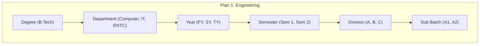
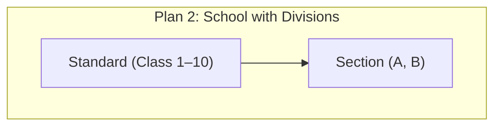
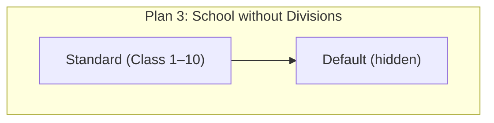
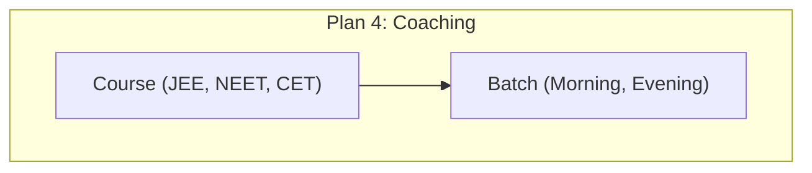
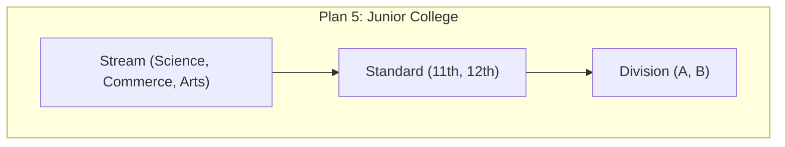
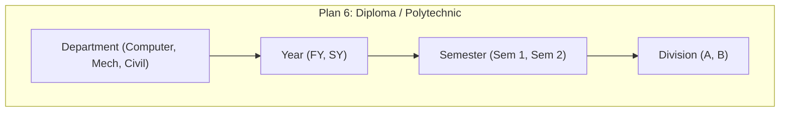
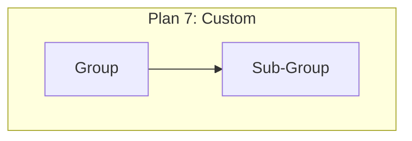
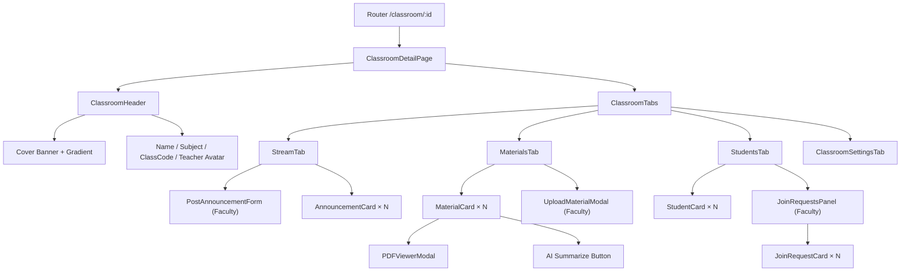

# 🏫 Classroom System — Complete Backend Architecture

This document maps out the **entire** Classroom backend system, which is the **core engine** that powers Classgrid's academic functionality. Everything else (AI, Chat, Attendance, Results, Exams) depends on this.

---

## 1. The 7 Organization Plans (Academic Hierarchy)

Your backend supports **7 distinct organization structures**, each with its own hierarchy tree. The `structure_type` field on the `Organization` model determines which plan is active.

### Plan Trees















---

## 2. The Terminology Engine

File: [terminology.js](file:///c:/Users/nikhi/OneDrive/Documents/Classgrid_platfrom/server/src/utils/terminology.js)

This is the **most critical utility** in the entire platform. Every single UI label changes based on the org type:

| Concept | Engineering | School | Coaching | Junior College | Diploma |
|---------|-------------|--------|----------|----------------|---------|
| **Org Label** | College | School | Institute | Junior College | Polytechnic |
| **Top Level** | Degree | Standard | Course | Stream | Department |
| **Course** | Branch | Class | Course | Stream | Branch |
| **Year** | Year | Class | *(null)* | Standard | Year |
| **Period** | Semester | Term | *(null)* | Term | Semester |
| **Division** | Division | Section | *(null)* | Division | Division |
| **Student ID** | PRN | Roll No | Enrollment No | Roll No | Enrollment No |
| **Teacher** | Faculty | Teacher | Mentor | Lecturer | Faculty |
| **Assignment** | Assignment | Homework | Practice Set | Assignment | Assignment |
| **Exam** | Examination | Test | Mock Test | Examination | Examination |

> [!IMPORTANT]
> The frontend **MUST** use this terminology API (`GET /api/hierarchy/terminology`) to dynamically label all UI elements. Never hardcode "Semester", "Division", etc.

---

## 3. Database Architecture (Dual-DB)

Your system uses **MongoDB + Supabase (PostgreSQL)** together:

### MongoDB Models

| Model | File | Purpose |
|-------|------|---------|
| **Organization** | [Organization.js](file:///c:/Users/nikhi/OneDrive/Documents/Classgrid_platfrom/server/src/models/Organization.js) | The org itself — branding, billing, structure_type, feature flags, admission config, HR config |
| **User** | [User.js](file:///c:/Users/nikhi/OneDrive/Documents/Classgrid_platfrom/server/src/models/User.js) | All users — 16+ roles, PRN, branch, batch, profile, auth tokens, push settings |
| **AcademicHierarchy** | [AcademicHierarchy.js](file:///c:/Users/nikhi/OneDrive/Documents/Classgrid_platfrom/server/src/models/AcademicHierarchy.js) | The tree nodes — degree, department, year, semester, division, sub_batch, standard, stream, course, batch |
| **Classroom** | [Classroom.js](file:///c:/Users/nikhi/OneDrive/Documents/Classgrid_platfrom/server/src/models/Classroom.js) | A single classroom — subject, teacher, classCode, division_id, subject_id, coverImage |
| **ClassroomMembership** | [ClassroomMembership.js](file:///c:/Users/nikhi/OneDrive/Documents/Classgrid_platfrom/server/src/models/ClassroomMembership.js) | Student enrollment — pending/approved/rejected status |
| **OrgSubject** | [OrgSubject.js](file:///c:/Users/nikhi/OneDrive/Documents/Classgrid_platfrom/server/src/models/OrgSubject.js) | Organization-wide subject registry (for marks) |

### Supabase (PostgreSQL) Tables

| Table | SQL File | Purpose |
|-------|----------|---------|
| **courses** | [SUPABASE_COURSE_MODULE_MIGRATION.sql](file:///c:/Users/nikhi/OneDrive/Documents/Classgrid_platfrom/supabase/sql/SUPABASE_COURSE_MODULE_MIGRATION.sql) | Top-level course grouping (FY, SY, Class 10, B.Tech CS) |
| **course_subjects** | Same file | Per-semester subjects with codes, credits, syllabus URLs |
| **faculty_assignments** | Same file | WHO teaches WHAT WHERE — links teacher_id → subject_id → division_id |
| **classroom_content** | *(in Supabase)* | Materials, Announcements, Quizzes — all content inside a classroom |

---

## 4. Backend API Endpoints

### Hierarchy API ([hierarchy.routes.js](file:///c:/Users/nikhi/OneDrive/Documents/Classgrid_platfrom/server/src/routes/hierarchy.routes.js))

| Method | Endpoint | Purpose |
|--------|----------|---------|
| `GET` | `/api/hierarchy/tree` | Full nested hierarchy tree for the org |
| `GET` | `/api/hierarchy/terminology` | Get org-specific UI labels |
| `GET` | `/api/hierarchy/children/:parentId` | Direct children of a node |
| `POST` | `/api/hierarchy/node` | Create a new hierarchy node |
| `POST` | `/api/hierarchy/seed` | One-time seed of default structure |
| `PATCH` | `/api/hierarchy/node/:nodeId` | Update a node |
| `DELETE` | `/api/hierarchy/node/:nodeId` | Soft-delete a node + descendants |

### Classroom API ([classroom.routes.js](file:///c:/Users/nikhi/OneDrive/Documents/Classgrid_platfrom/classgrid_platform/server/src/routes/classroom.routes.js))

| Method | Endpoint | Purpose |
|--------|----------|---------|
| `POST` | `/` | Create a classroom (Faculty only) |
| `GET` | `/` | List my classrooms |
| `GET` | `/discover` | Browse open classrooms in my org |
| `GET` | `/:id` | Get classroom details |
| `PUT` | `/:id` | Update classroom info |
| `DELETE` | `/:id` | Delete a classroom |
| `PUT` | `/:id/cover` | Upload cover image |
| `POST` | `/join-by-code` | Student joins via 10-char code |
| `POST` | `/:id/join` | Student requests to join |
| `GET` | `/:id/requests` | Faculty: view pending join requests |
| `PUT` | `/:id/requests/:requestId` | Approve/reject a request |
| `PUT` | `/:id/requests-bulk` | Bulk approve/reject |
| `GET` | `/:id/members` | List classroom members |
| `DELETE` | `/:id/members/:userId` | Remove a student |
| `GET` | `/:id/students` | Get student list with profiles |
| `POST` | `/:id/content/:type` | Add content (materials, announcements, quizzes) |
| `GET` | `/:id/content/:type` | Get content by type |
| `PUT` | `/:id/content/:type/:contentId` | Update content |
| `DELETE` | `/:id/content/:type/:contentId` | Delete content |
| `PUT` | `/:id/content/materials/:contentId/replace` | Replace a PDF file |
| `POST` | `/:id/content/materials/:contentId/summarize` | AI-summarize a PDF |
| `POST` | `/:id/upload-urls` | Get presigned upload URLs |
| `POST` | `/:id/notify` | Send push notification to students |
| `POST` | `/:id/resend-notification` | Resend a notification |
| `GET` | `/:id/meetings` | Get classroom meetings |
| `GET` | `/all-requests` | Faculty: all pending requests across classrooms |
| `GET` | `/my-requests` | Student: my pending requests |
| `GET` | `/my-organization` | Get org info |
| `POST` | `/hf-summarize` | AI text summarization |
| `GET` | `/proxy/pdf` | Proxy PDF for CORS |

---

## 5. Current Frontend Status

> [!WARNING]
> The Classroom frontend is **extremely minimal**. Only 2 files exist:

| File | What it does | What's missing |
|------|-------------|----------------|
| [ClassroomsPage.tsx](file:///c:/Users/nikhi/OneDrive/Documents/Classgrid_platfrom/classgrid_platform/client/src/features/classrooms/pages/ClassroomsPage.tsx) | Lists classroom cards with search, gradient covers, teacher photo | No click-through to classroom detail, no join-by-code UI, no discover page |
| [CreateClassroomModal.tsx](file:///c:/Users/nikhi/OneDrive/Documents/Classgrid_platfrom/classgrid_platform/client/src/features/classrooms/components/CreateClassroomModal.tsx) | Modal for faculty to create a classroom | Limited — doesn't use hierarchy/division selectors |

---

## 6. Proposed Folder Structure

This follows the same pattern as the existing `chat` feature (pages → components → services → hooks → queries).

```
client/src/features/classrooms/
│
├── pages/
│   ├── ClassroomsPage.tsx              ← [EXISTS] List of classroom cards
│   ├── ClassroomDetailPage.tsx         ← [NEW] Main page after clicking a card
│   └── DiscoverClassroomsPage.tsx      ← [NEW] Browse & join open classrooms
│
├── components/
│   │
│   │── CreateClassroomModal.tsx        ← [EXISTS] Create form (needs hierarchy selectors)
│   │── JoinClassroomModal.tsx          ← [NEW] Student enters 10-char code
│   │
│   │── ── Classroom Detail Components ──
│   │── ClassroomHeader.tsx             ← [NEW] Cover banner, name, subject, code, teacher
│   │── ClassroomTabs.tsx               ← [NEW] Tab navigation (Stream|Materials|Students|Settings)
│   │
│   │── ── Tab Content Components ──
│   │── StreamTab.tsx                   ← [NEW] Announcements feed (post + view)
│   │── AnnouncementCard.tsx            ← [NEW] Single announcement with time, text, reactions
│   │── PostAnnouncementForm.tsx        ← [NEW] Faculty: rich text input + post button
│   │
│   │── MaterialsTab.tsx               ← [NEW] Grid/list of uploaded files
│   │── MaterialCard.tsx               ← [NEW] File card with icon, name, size, download, summarize
│   │── UploadMaterialModal.tsx         ← [NEW] Faculty: drag-drop file upload
│   │── PDFViewerModal.tsx             ← [NEW] In-app PDF viewer with AI summarize
│   │
│   │── StudentsTab.tsx                ← [NEW] Student roster with search
│   │── StudentCard.tsx                ← [NEW] Student avatar, name, PRN, status
│   │── JoinRequestsPanel.tsx          ← [NEW] Faculty: approve/reject/bulk
│   │── JoinRequestCard.tsx            ← [NEW] Single join request with actions
│   │
│   │── ClassroomSettingsTab.tsx        ← [NEW] Edit name, subject, cover, archive, delete
│   │── ClassroomCoverUpload.tsx        ← [NEW] Cover image upload/preview
│   │
│   │── ── Shared / Hierarchy Components ──
│   │── HierarchySelector.tsx           ← [NEW] Cascading dropdowns (Degree → Dept → Year → Sem → Div)
│   └── EmptyState.tsx                  ← [NEW] Reusable empty state (no materials, no students)
│
├── services/
│   └── classroomApi.ts                ← [NEW] All API calls (axios wrappers)
│
├── hooks/
│   ├── useTerminology.ts              ← [NEW] Fetches & caches org terminology labels
│   └── useClassroomRole.ts            ← [NEW] Returns if current user is teacher or student
│
├── queries/
│   ├── useMyClassrooms.ts             ← [EXISTS] List my classrooms
│   ├── useCreateClassroom.ts          ← [EXISTS] Create classroom mutation
│   ├── useClassroomDetail.ts          ← [NEW] GET /:id — full classroom data
│   ├── useClassroomContent.ts         ← [NEW] GET /:id/content/:type
│   ├── useClassroomMembers.ts         ← [NEW] GET /:id/members
│   ├── useClassroomRequests.ts        ← [NEW] GET /:id/requests
│   ├── useDiscoverClassrooms.ts       ← [NEW] GET /discover
│   ├── useJoinClassroom.ts            ← [NEW] POST /join-by-code mutation
│   └── useHierarchyTree.ts            ← [NEW] GET /api/hierarchy/tree
│
└── types/
    └── classroom.types.ts             ← [NEW] All TypeScript interfaces
```

---

## 7. Component Architecture (Visual Tree)



---

## 8. TypeScript Types (`classroom.types.ts`)

```typescript
// ── Organization Terminology ──
export interface Terminology {
  org_label: string;      // "College" | "School" | "Institute"
  top_level: string;      // "Degree" | "Standard" | "Course"
  course: string;         // "Branch" | "Class" | "Course"
  year: string | null;
  period: string | null;  // "Semester" | "Term"
  division: string | null;
  sub_batch: string | null;
  student_id: string;     // "PRN" | "Roll No" | "Enrollment No"
  teacher: string;        // "Faculty" | "Teacher" | "Mentor"
  classroom: string;
  assignment_label: string;
  exam_label: string;
  hierarchy: string[];
}

// ── Classroom ──
export interface Classroom {
  _id: string;
  name: string;
  subject: string;
  description: string;
  classCode: string;
  coverImage: string;
  teacher: {
    _id: string;
    name: string;
    email: string;
    profilePicture?: string;
  };
  organization_id: string;
  course_type: "SCHOOL" | "COLLEGE";
  year?: string;
  branch?: string;
  semester?: number;
  standard?: string;
  division?: string;
  division_id?: string;
  subject_id?: string;
  settings: {
    allowJoinRequests: boolean;
    maxStudents?: number;
    isArchived: boolean;
  };
  memberCount: number;
  createdAt: string;
}

// ── Classroom Content (Supabase) ──
export interface ClassroomContent {
  id: string;
  classroom_id: string;
  content_type: "materials" | "announcements" | "quizzes";
  title: string;
  message?: string;
  description?: string;
  file_url?: string;
  type?: string;    // pdf, image, link
  duration?: number; // quiz duration
  created_at: string;
}

// ── Classroom Member ──
export interface ClassroomMember {
  _id: string;
  student: {
    _id: string;
    name: string;
    email: string;
    profilePicture?: string;
    prn?: string;
    branch?: string;
    batch?: string;
  };
  status: "pending" | "approved" | "rejected";
  requestedAt: string;
  respondedAt?: string;
}

// ── Hierarchy Node ──
export interface HierarchyNode {
  _id: string;
  level_type: string;
  name: string;
  code: string;
  parent_id: string | null;
  sort_order: number;
  is_active: boolean;
  children: HierarchyNode[];
}
```

---

## 9. API Service Layer (`classroomApi.ts`)

```typescript
// All functions that classroomApi.ts needs to expose:

// ── Classroom CRUD ──
fetchMyClassrooms()
fetchClassroomById(id)
createClassroom(data)
updateClassroom(id, data)
deleteClassroom(id)
uploadCoverImage(id, file)

// ── Enrollment ──
joinByCode(code)
requestJoin(classroomId)
fetchJoinRequests(classroomId)
respondToRequest(classroomId, requestId, action)
bulkRespondRequests(classroomId, requestIds, action)

// ── Members ──
fetchMembers(classroomId)
fetchStudents(classroomId)
removeMember(classroomId, userId)

// ── Content ──
fetchContent(classroomId, type)
createContent(classroomId, type, data)
updateContent(classroomId, type, contentId, data)
deleteContent(classroomId, type, contentId)
replaceFile(classroomId, contentId, file)
summarizeContent(classroomId, contentId)
getUploadUrls(classroomId, files)

// ── Discovery ──
fetchDiscoverClassrooms()
fetchAllRequests()      // faculty: all pending across classrooms
fetchMyRequests()       // student: my pending requests

// ── Hierarchy ──
fetchHierarchyTree()
fetchTerminology()
fetchChildren(parentId)

// ── Notifications ──
sendNotification(classroomId, data)
```

---

## 10. Router Integration

The existing router at [router.tsx](file:///c:/Users/nikhi/OneDrive/Documents/Classgrid_platfrom/classgrid_platform/client/src/app/router.tsx) currently has:
```tsx
<Route path="/classroom" element={<ClassroomsPage />} />    // line 292
<Route path="/classrooms" element={<ClassroomsPage />} />   // line 293
```

We need to add:
```tsx
<Route path="/classroom/:id" element={<ClassroomDetailPage />} />
<Route path="/classrooms/discover" element={<DiscoverClassroomsPage />} />
```

---

## 11. What Needs to Be Built (Summary)

### Phase 1: Core Classroom Experience (Critical)

| Component | Description |
|-----------|-------------|
| **ClassroomDetailPage** | Main page after clicking a card — tabs layout |
| **ClassroomHeader** | Cover banner, name, subject, classCode badge, teacher info |
| **ClassroomTabs** | Tab navigation component |
| **StreamTab** + **AnnouncementCard** + **PostAnnouncementForm** | Announcements feed |
| **MaterialsTab** + **MaterialCard** + **UploadMaterialModal** | File management |
| **StudentsTab** + **StudentCard** | Student roster |
| **JoinClassroomModal** | Student enters code |
| **classroomApi.ts** | Full API service layer |
| **classroom.types.ts** | All TypeScript interfaces |
| **useClassroomDetail** + **useClassroomContent** + **useClassroomMembers** | React Query hooks |

### Phase 2: Management & Discovery

| Component | Description |
|-----------|-------------|
| **JoinRequestsPanel** + **JoinRequestCard** | Faculty approve/reject requests |
| **ClassroomSettingsTab** | Edit classroom, archive, delete |
| **DiscoverClassroomsPage** | Browse open classrooms |
| **PDFViewerModal** | In-app PDF viewer with AI summarize |
| **HierarchySelector** | Cascading dropdowns for hierarchy |

### Phase 3: Enhanced CreateClassroomModal

| Component | Description |
|-----------|-------------|
| Upgrade **CreateClassroomModal** | Add HierarchySelector so faculty picks Division → Subject → auto-fills fields |
| **useTerminology** hook | Dynamically label all UI elements based on org type |

---

## Open Questions

> [!IMPORTANT]
> **Q1:** Should the ClassroomDetailPage use a **tabbed layout** (Stream | Materials | Students | Chat) or a **sidebar layout** (like Google Classroom)?

> [!IMPORTANT]
> **Q2:** For the 4 target org types (School, College/Engineering, Junior College, Diploma) — should we build a single adaptive UI that changes labels dynamically using the terminology API, or separate layouts per org type?

> [!IMPORTANT]
> **Q3:** Should the AI Chatbot (the Classgrid AI study assistant from `chat.js`) be embedded inside each classroom as a tab, or should it remain a separate global page?

## Verification Plan

### Manual Verification
- Test creating classrooms as Faculty
- Test joining classrooms as Student (via code)
- Test all 4 org types render correct terminology
- Test content upload (announcements, materials)
- Verify classroom card navigation works end-to-end
🏫 Classgrid Classroom — The Heart Build

> **The Rule**: One task per session. Build it. Test it. Verify it. Then move on.
> **No shortcuts. No rushing. This is the foundation of everything.**

---

## 🔧 Phase 0: Foundation (No UI — Just Plumbing)

These tasks create the invisible plumbing that every single component depends on. If these are wrong, everything built on top will collapse.

### Task 1: TypeScript Types
- [ ] Create `client/src/features/classrooms/types/classroom.types.ts`
- Interfaces: `Terminology`, `Classroom`, `ClassroomContent`, `ClassroomMember`, `HierarchyNode`, `JoinRequest`
- Export everything. This file will be imported by every other file.

### Task 2: API Service Layer (Part 1 — Read Operations)
- [ ] Create `client/src/features/classrooms/services/classroomApi.ts`
- Functions: `fetchMyClassrooms`, `fetchClassroomById`, `fetchClassroomContent`, `fetchClassroomMembers`, `fetchClassroomStudents`, `fetchJoinRequests`, `fetchDiscoverClassrooms`, `fetchAllRequests`, `fetchMyRequests`
- All using `apiClient.get()` with proper TypeScript return types

### Task 3: API Service Layer (Part 2 — Write Operations)
- [ ] Add to `classroomApi.ts`:
- Functions: `createClassroom`, `updateClassroom`, `deleteClassroom`, `uploadCoverImage`, `joinByCode`, `requestJoin`, `respondToRequest`, `bulkRespondRequests`, `removeMember`

### Task 4: API Service Layer (Part 3 — Content Operations)
- [ ] Add to `classroomApi.ts`:
- Functions: `createContent`, `updateContent`, `deleteContent`, `replaceFile`, `summarizeContent`, `getUploadUrls`, `sendNotification`

### Task 5: API Service Layer (Part 4 — Hierarchy Operations)
- [ ] Add to `classroomApi.ts`:
- Functions: `fetchHierarchyTree`, `fetchTerminology`, `fetchHierarchyChildren`

### Task 6: React Query Hooks (Part 1 — Core Queries)
- [ ] Create `queries/useClassroomDetail.ts` — fetches single classroom by ID
- [ ] Create `queries/useClassroomContent.ts` — fetches content by type (materials/announcements/quizzes)
- [ ] Create `queries/useClassroomMembers.ts` — fetches member list

### Task 7: React Query Hooks (Part 2 — Enrollment Queries)
- [ ] Create `queries/useClassroomRequests.ts` — fetches join requests (faculty)
- [ ] Create `queries/useDiscoverClassrooms.ts` — fetches discoverable classrooms
- [ ] Create `queries/useJoinClassroom.ts` — mutation hook for joining by code

### Task 8: React Query Hooks (Part 3 — Hierarchy)
- [ ] Create `queries/useHierarchyTree.ts` — fetches full hierarchy tree
- [ ] Create `hooks/useTerminology.ts` — fetches + caches org terminology labels
- [ ] Create `hooks/useClassroomRole.ts` — returns if current user is teacher/student for this classroom

### Task 9: Router Setup
- [ ] Add route `/classroom/:id` → `ClassroomDetailPage` in `router.tsx`
- [ ] Add route `/classrooms/discover` → `DiscoverClassroomsPage` in `router.tsx`
- [ ] Create empty placeholder pages that just render "Coming..." so routes don't crash

---

## 🎨 Phase 1: The Classroom Detail Page Shell

### Task 10: ClassroomDetailPage — Layout Skeleton
- [ ] Create `pages/ClassroomDetailPage.tsx`
- Reads `classroomId` from URL params
- Calls `useClassroomDetail(classroomId)` to fetch data
- Shows loading spinner while fetching
- Renders `ClassroomHeader` + `ClassroomTabs`
- No tab content yet — just the shell

### Task 11: ClassroomHeader — Cover Banner
- [ ] Create `components/ClassroomHeader.tsx`
- Beautiful gradient cover banner (with actual cover image overlay if available)
- Classroom name (large, bold)
- Subject name
- Class code badge (copyable on click)
- Teacher avatar + name
- Member count badge

### Task 12: ClassroomTabs — Tab Navigation
- [ ] Create `components/ClassroomTabs.tsx`
- Tab bar: Stream | Materials | Students | Settings
- Active tab state management
- Renders the correct tab content component based on active tab
- Smooth transition between tabs

### Task 13: EmptyState Component
- [ ] Create `components/EmptyState.tsx`
- Reusable empty state with icon, title, description, optional CTA button
- Used by every tab when there's no data

### Task 14: Make ClassroomCard Clickable
- [ ] Update `ClassroomsPage.tsx` — wrap `ClassroomCard` in a `<Link to={/classroom/${id}}>` 
- Clicking a card now navigates to the detail page
- **Test**: Click a classroom card → see the header + empty tabs

---

## 📢 Phase 2: Stream Tab (Announcements)

### Task 15: StreamTab — Announcements Feed
- [ ] Create `components/StreamTab.tsx`
- Calls `useClassroomContent(classroomId, "announcements")`
- Maps over announcements, renders `AnnouncementCard` for each
- Shows `EmptyState` if no announcements
- Faculty sees `PostAnnouncementForm` at the top

### Task 16: AnnouncementCard
- [ ] Create `components/AnnouncementCard.tsx`
- Teacher avatar + name
- Timestamp (relative: "2 hours ago")
- Announcement text (supports multi-line)
- Subtle card styling with left border accent

### Task 17: PostAnnouncementForm
- [ ] Create `components/PostAnnouncementForm.tsx`
- Only visible to faculty (use `useClassroomRole`)
- Text input with "Post" button
- Calls `createContent(classroomId, "announcements", { message })` on submit
- Invalidates query cache on success
- **Test**: Faculty posts an announcement → it appears in the feed immediately

---

## 📁 Phase 3: Materials Tab

### Task 18: MaterialsTab — File Grid
- [ ] Create `components/MaterialsTab.tsx`
- Calls `useClassroomContent(classroomId, "materials")`
- Grid layout of `MaterialCard` components
- Faculty sees "Upload Material" button
- Shows `EmptyState` if no materials

### Task 19: MaterialCard
- [ ] Create `components/MaterialCard.tsx`
- File type icon (PDF, image, doc, etc.)
- File name + description
- Upload date
- Download button (opens file_url in new tab)
- AI "Summarize" button (if PDF)
- Faculty: delete button

### Task 20: UploadMaterialModal
- [ ] Create `components/UploadMaterialModal.tsx`
- Modal with title input + description input
- File drag-and-drop zone OR file picker button
- Uses `getUploadUrls` → uploads to R2 → `createContent` to save
- Progress indicator during upload
- **Test**: Faculty uploads a PDF → it appears in the materials grid

### Task 21: PDFViewerModal
- [ ] Create `components/PDFViewerModal.tsx`
- Full-screen modal with embedded PDF viewer (using `/proxy/pdf` endpoint)
- "AI Summarize" button that calls `summarizeContent`
- Shows AI-generated summary in a side panel or overlay
- Close button

---

## 👥 Phase 4: Students Tab

### Task 22: StudentsTab — Student Roster
- [ ] Create `components/StudentsTab.tsx`
- Calls `useClassroomMembers(classroomId)` or `useClassroomStudents`
- Search bar to filter by name/PRN
- Grid or list of `StudentCard` components
- Faculty: shows "Pending Requests" section if any

### Task 23: StudentCard
- [ ] Create `components/StudentCard.tsx`
- Student avatar (or initials fallback)
- Name (bold)
- PRN / Roll No (using terminology labels)
- Branch / Batch info
- Faculty: "Remove" button with confirmation

### Task 24: JoinRequestsPanel
- [ ] Create `components/JoinRequestsPanel.tsx`
- Only visible to faculty
- Calls `useClassroomRequests(classroomId)`
- List of `JoinRequestCard` components
- "Approve All" / "Reject All" bulk action buttons

### Task 25: JoinRequestCard
- [ ] Create `components/JoinRequestCard.tsx`
- Student avatar + name + PRN
- Request date
- Optional request message from student
- Approve (green) / Reject (red) buttons
- Calls `respondToRequest` on click
- **Test**: Student requests to join → Faculty sees it → Approves → Student appears in roster

---

## 🔗 Phase 5: Join & Discover

### Task 26: JoinClassroomModal
- [ ] Create `components/JoinClassroomModal.tsx`
- Modal with a single input field for the 10-character class code
- "Join" button calls `joinByCode(code)`
- Success: toast + redirect to classroom detail
- Error: "Invalid code" or "Already a member" messaging
- Triggered from ClassroomsPage "Join Class" button

### Task 27: DiscoverClassroomsPage
- [ ] Create `pages/DiscoverClassroomsPage.tsx`
- Calls `useDiscoverClassrooms()`
- Grid of classroom cards with "Request to Join" button
- Search/filter by name, subject, teacher
- Shows membership status (pending/approved) if already requested

---

## ⚙️ Phase 6: Settings & Management

### Task 28: ClassroomSettingsTab
- [ ] Create `components/ClassroomSettingsTab.tsx`
- Only visible to faculty (classroom owner)
- Edit classroom name, subject, description
- Toggle "Allow Join Requests"
- Change max students
- "Archive Classroom" toggle
- "Delete Classroom" button (with double-confirm dialog)

### Task 29: ClassroomCoverUpload
- [ ] Create `components/ClassroomCoverUpload.tsx`
- Embedded in ClassroomSettingsTab or ClassroomHeader
- Click to upload new cover image
- Preview before saving
- Calls `uploadCoverImage(classroomId, file)`

---

## 🌳 Phase 7: Hierarchy & Smart Create

### Task 30: HierarchySelector
- [ ] Create `components/HierarchySelector.tsx`
- Cascading dropdown component
- Fetches hierarchy tree via `useHierarchyTree()`
- Engineering: Degree → Department → Year → Semester → Division
- School: Standard → Section
- Coaching: Course → Batch
- Auto-adapts based on org terminology
- Returns selected `division_id` to parent component

### Task 31: Upgrade CreateClassroomModal
- [ ] Add `HierarchySelector` to `CreateClassroomModal.tsx`
- Faculty picks their Division from the tree
- Subject dropdown auto-populates from `course_subjects` for that division
- Division + Subject auto-fill the classroom's `division_id` and `subject_id`
- Much smarter than the current "type a name" form

---

## 🧠 Phase 8: AI Integration Inside Classroom

### Task 32: ClassroomAITab
- [ ] Create `components/ClassroomAITab.tsx`
- Add "AI Assistant" as a 5th tab in ClassroomTabs
- Embeds the Classgrid AI chatbot (from `chat.routes.js`)
- Automatically passes classroom context (materials, announcements, timetable)
- Student can ask: "Summarize the latest PDF" or "What's my next lecture?"

### Task 33: AI Summarize Integration
- [ ] Add "Summarize with AI" button to MaterialCard for PDF files
- Clicking it calls `POST /classrooms/:id/content/materials/:contentId/summarize`
- Shows loading shimmer while AI processes
- Displays the markdown summary in a beautiful modal

### Task 34: Smart Reply Chips
- [ ] Add AI smart reply suggestion chips above the AI chat input
- Calls `POST /threads/:id/suggest-replies` from `thread_chat.routes.js`
- Shows 3 tappable chip suggestions that auto-fill the input

---

## 🔔 Phase 9: Notifications & Real-time

### Task 35: Push Notification from Classroom
- [ ] Add "Notify Students" button in StreamTab (faculty only)
- Opens a small modal: "Send notification about this announcement?"
- Calls `sendNotification(classroomId, { title, body })`
- Toast: "Notification sent to X students"

### Task 36: Real-time Announcement Updates
- [ ] Set up Supabase Realtime subscription on `classroom_content` table
- When a new announcement is posted, auto-append it to the feed
- No page refresh needed

---

## 🎨 Phase 10: Polish & Premium Feel

### Task 37: Classroom Card Redesign
- [ ] Upgrade `ClassroomCard` in ClassroomsPage
- Add subtle hover animations (scale, shadow lift)
- Show last activity time ("Active 2h ago")
- Show unread announcement badge count
- Skeleton loading states

### Task 38: Loading States & Skeletons
- [ ] Add skeleton loading states to:
  - ClassroomDetailPage (header shimmer + tab shimmer)
  - StreamTab (announcement card shimmers)
  - MaterialsTab (file card shimmers)
  - StudentsTab (student card shimmers)

### Task 39: Error States & Edge Cases
- [ ] Handle: classroom not found (404 page)
- [ ] Handle: not a member (access denied page)
- [ ] Handle: classroom archived (read-only mode)
- [ ] Handle: network errors (retry buttons)

### Task 40: Mobile Responsiveness
- [ ] Make ClassroomDetailPage fully responsive
- [ ] Tabs become scrollable horizontal pills on mobile
- [ ] Materials grid becomes single column
- [ ] Student cards stack vertically
- [ ] Header cover image adapts height

### Task 41: Classroom Chat Tab
- [ ] Add "Chat" as a tab in ClassroomTabs
- [ ] Connect to `classroom_chat.routes.js` backend
- [ ] Reuse existing ChatConversation / ChatBubble components
- [ ] Real-time messaging within the classroom context

### Task 42: Quizzes Tab
- [ ] Create `components/QuizzesTab.tsx`
- [ ] Fetch quizzes via `useClassroomContent(classroomId, "quizzes")`
- [ ] Quiz cards showing title, duration, question count
- [ ] Faculty: create quiz form
- [ ] Student: take quiz flow

---

## ✅ Final Verification

### Task 43: Full Integration Test
- [ ] Create classroom as Faculty → verify card appears
- [ ] Click card → verify detail page loads with header + tabs
- [ ] Post announcement → verify it appears in stream
- [ ] Upload PDF → verify it appears in materials
- [ ] Student joins via code → verify they appear in roster
- [ ] Faculty approves request → verify student status changes
- [ ] AI summarize PDF → verify summary appears
- [ ] Test all 4 org types (Engineering, School, Junior College, Diploma) → verify terminology labels change correctly
- [ ] Test on mobile → verify responsive layout
- [ ] Run `npm run build` → verify zero errors

---

> **Remember**: Each task is one session. Don't skip ahead. Don't combine tasks.
> The classroom system is the heart of Classgrid — it deserves patience. 💙
